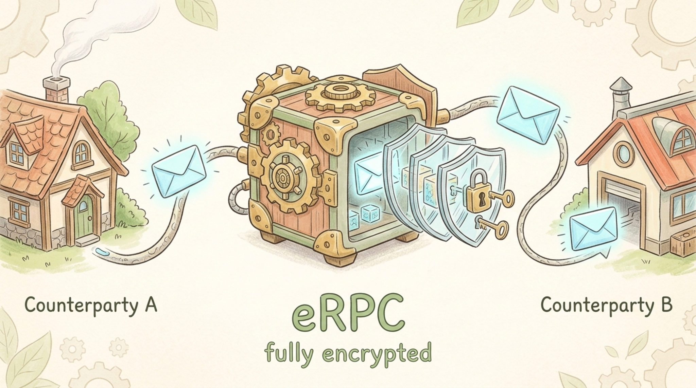

# eRPC

[](https://www.npmjs.com/package/@dotex/erpc)
[](./LICENSE)
[](https://www.typescriptlang.org/)

**Encrypted, typed RPC over any bidirectional channel.** Two peers, one shared secret (or one keypair), every call end-to-end encrypted with XSalsa20-Poly1305 AEAD. WebSocket, `postMessage`, `MessagePort`, `chrome.runtime`, `BroadcastChannel`, WebRTC — if it can carry bytes, eRPC encrypts and types them.

Think tRPC, but transport-agnostic and encrypted by default.

```bash
npm install @dotex/erpc
```



- **Full docs and rationale:** <https://dotex.org/epic/erpc>
- [Quickstart](./spec/getting-started.md) · [API](./spec/api.md) · [Wire Protocol](./spec/protocol.md) · [Security](./spec/security.md) · [Transports](./spec/integrations.md)

## Highlights

- **Typed procedures** with Zod input/output validation.
- **End-to-end encryption** — X25519 ECDH, XSalsa20-Poly1305 AEAD, HKDF-SHA-256, forward secrecy.
- **Lazy handshake** on first call, transparent auto-retry on session drop.
- **Three auth modes** — PSK, asymmetric (Ed25519 / ECDSA / JWT / cert / multifactor), or both for defense-in-depth.
- **Synchronous** `client()` / `server()` — works in Node.js, browsers, Service Workers, React Native, Vercel Edge, Cloudflare Workers, Deno Deploy.
- **Tiny surface** — `@noble/*` crypto, `@msgpack/msgpack`, `zod`, and nothing else.
- **Pure ESM + CJS dual build**, side-effect-free, tree-shakeable.

## Quick start

```typescript
import { chain, server, client } from "@dotex/erpc";
import { z } from "zod";

const d = chain();

const router = {
  greet: d
    .input(z.object({ name: z.string() }))
    .output(z.object({ message: z.string() }))
    .handler(async ({ input }) => ({
      message: `Hello, ${input.name}!`,
    })),
};

const psk = crypto.getRandomValues(new Uint8Array(32));
const auth = { psk: () => psk };

const { destroy: stopServer } = server(router, serverChannel, { auth });
const { api, destroy: stopClient } = client<typeof router>(clientChannel, { auth });

const { message } = await api.greet({ name: "World" });
```

`client()` and `server()` are synchronous — no top-level `await`. The handshake runs lazily on the first procedure call. If the session drops, the next call retries once with a fresh handshake.

## Channel — the only transport contract

```typescript
interface Channel {
  send(data: Uint8Array): void | Promise<void>;
  receive(cb: (data: Uint8Array) => void): () => void; // returns unsubscribe
}
```

Anything that satisfies this can host an eRPC session. Ready-made adapters for WebSocket, `postMessage`, `MessagePort`, Chrome extension ports, `BroadcastChannel`, WebRTC, TCP, and SSE live in [spec/integrations.md](./spec/integrations.md).

## Authentication

Three modes, all configured through the same `auth` block.

```typescript
// PSK only — simple, fast, controlled environments
auth: { psk: () => sharedSecret }

// Asymmetric only — public clients, no shared secrets
auth: {
  sign: (transcript) => signWithDeviceKey(transcript),
  verify: (proof, transcript) => verifyPeerSignature(proof, transcript),
}

// Both — defense-in-depth (session binding + identity proof)
auth: {
  psk: () => deriveSessionPSK(sessionId, deploymentSecret),
  sign: (transcript) => signWithDeviceKey(transcript),
  verify: (proof, transcript) => verifyPeerSignature(proof, transcript),
}
```

Built-in helpers for Ed25519, ECDSA P-256, JWT, certificate-based, and multifactor auth — all transcript-bound, so captured payloads can't be replayed. See [spec/security.md](./spec/security.md) for the threat model.

## Errors

```typescript
import { RPCError, RemoteRPCError } from "@dotex/erpc";

try {
  await api.greet({ name: "World" });
} catch (err) {
  if (err instanceof RemoteRPCError) {
    // The remote peer threw — err.code / err.message / err.data come from there
  } else if (err instanceof RPCError) {
    // Local failure — TIMEOUT, SESSION, HANDSHAKE, INPUT_VALIDATION, ...
  } else {
    throw err;
  }
}
```

## Package layout

```
src/
  common.ts       — Shared types, crypto, msgpack, chain builder
  server.ts       — Resilient handshake server
  client.ts       — Lazy handshake client with auto-retry
  auth.ts         — Re-exports for auth helpers
  authClient.ts   — Ed25519, ECDSA, JWT client helpers
  authServer.ts   — Ed25519, ECDSA, JWT, certificate, multifactor server helpers
  index.ts        — Public entry point
```

```typescript
import { chain, server, client, RPCError } from "@dotex/erpc";
// Subpaths also available for tree-shaking:
import { server } from "@dotex/erpc/server";
import { client } from "@dotex/erpc/client";
import { chain, RPCError } from "@dotex/erpc/common";
```

## Compatibility

Node.js 18+, modern browsers, Service / Web / Shared Workers, React Native, Vercel Edge, Cloudflare Workers, Deno Deploy. WebCrypto is required only for the ECDSA and certificate helpers.

## Project status

`0.x` with a stable wire protocol (`drpc-v1` HKDF info, `erpc-hs-{hello,reply}-v1` transcript prefixes). Test coverage for handshake attacks, replay, tampering, type confusion, prototype pollution, middleware misuse, and DoS limits lives in `test/security/`. A 1.0 release will lock the public API surface.

## License

MIT © [Dotex](https://dotex.org/about)
