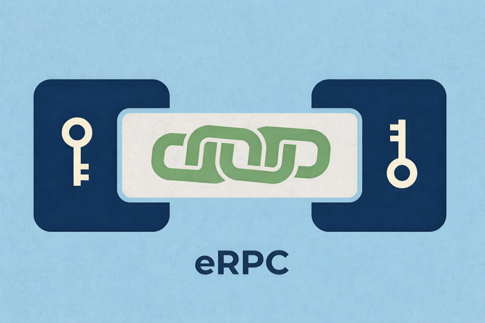

# Safe RPC

[](https://www.npmjs.com/package/@dotex/saferpc)
[](./LICENSE)
[](https://www.typescriptlang.org/)

**Encrypted, typed RPC over any bidirectional channel.** Two peers, one shared secret (or one keypair). Every call is end-to-end encrypted with XSalsa20-Poly1305 AEAD. WebSocket, `postMessage`, `MessagePort`, `chrome.runtime`, `BroadcastChannel`, WebRTC — if a channel can carry bytes, Safe RPC encrypts and types what flows through it.

Think tRPC, but transport-agnostic and encrypted by default.

```bash
npm install @dotex/saferpc
```



- **Full docs and rationale:** <https://dotex.org/epic/saferpc>
- [Quickstart](./spec/getting-started.md) · [API](./spec/api.md) · [Wire Protocol](./spec/protocol.md) · [Security](./spec/security.md) · [Transports](./spec/integrations.md)

## Highlights

- **Typed procedures** with Zod input/output validation
- **End-to-end encryption.** X25519 ECDH, XSalsa20-Poly1305 AEAD, HKDF-SHA-256, with forward secrecy by design
- **Lazy handshake** on the first call. Transparent auto-retry when the session drops
- **Three auth modes:** pre-shared secret, asymmetric (Ed25519 / ECDSA / JWT / cert / multifactor), or both for defense-in-depth
- **Synchronous** `client()` and `server()`. Runs in Node.js, browsers, Service Workers, React Native, Vercel Edge, Cloudflare Workers, Deno Deploy
- **Tiny surface.** `@noble/*` crypto, `@msgpack/msgpack`, `zod`, and nothing else
- **Pure ESM + CJS dual build**, side-effect-free, tree-shakeable

## Quick start

```typescript
import { chain, server, client } from "@dotex/saferpc";
import { z } from "zod";

const d = chain();

const router = {
  greet: d
    .input(z.object({ name: z.string() }))
    .output(z.object({ message: z.string() }))
    .handler(async ({ input }) => ({
      message: `Hello, ${input.name}!`,
    })),
};

const secret = crypto.getRandomValues(new Uint8Array(32));
const auth = { secret: () => secret };

const { destroy: stopServer } = server(router, serverChannel, { auth });
const { api, destroy: stopClient } = client<typeof router>(clientChannel, { auth });

const { message } = await api.greet({ name: "World" });
```

`client()` and `server()` are synchronous. No top-level `await`. The handshake runs lazily on the first procedure call. If the session drops, the next call retries once with a fresh handshake.

## Channel: the only transport contract

```typescript
interface Channel {
  send(data: Uint8Array): void | Promise<void>;
  receive(cb: (data: Uint8Array) => void): () => void; // returns unsubscribe
}
```

Anything that satisfies this can host a Safe RPC session. Ready-made adapters for WebSocket, `postMessage`, `MessagePort`, Chrome extension ports, `BroadcastChannel`, WebRTC, TCP, and SSE live in [spec/integrations.md](./spec/integrations.md).

## Authentication

Three modes. The `auth` block is the same shape in all three.

```typescript
// Secret only. Simple, fast, controlled environments.
auth: { secret: () => sharedSecret }

// Asymmetric only. Public clients, no shared secrets.
auth: {
  sign: (transcript) => signWithDeviceKey(transcript),
  verify: (proof, transcript) => verifyPeerSignature(proof, transcript),
}

// Both. Session binding plus identity proof.
auth: {
  secret: () => deriveSessionSecret(sessionId, deploymentSecret),
  sign: (transcript) => signWithDeviceKey(transcript),
  verify: (proof, transcript) => verifyPeerSignature(proof, transcript),
}
```

Built-in helpers cover Ed25519, ECDSA P-256, JWT, certificate-based, and multifactor auth. All bind their proof to the handshake transcript, so a captured payload cannot be replayed into a new session. The full threat model lives in [spec/security.md](./spec/security.md).

## Errors

```typescript
import { RPCError, RemoteRPCError } from "@dotex/saferpc";

try {
  await api.greet({ name: "World" });
} catch (err) {
  if (err instanceof RemoteRPCError) {
    // The remote peer threw. err.code / err.message / err.data come from there.
  } else if (err instanceof RPCError) {
    // Local failure: TIMEOUT, SESSION, HANDSHAKE, INPUT_VALIDATION, ...
  } else {
    throw err;
  }
}
```

## Package layout

```
src/
  common.ts       : shared types, crypto, msgpack, chain builder
  server.ts       : resilient handshake server
  client.ts       : lazy handshake client with auto-retry
  auth.ts         : re-exports for auth helpers
  authClient.ts   : Ed25519, ECDSA, JWT client helpers
  authServer.ts   : Ed25519, ECDSA, JWT, certificate, multifactor server helpers
  index.ts        : public entry point
```

```typescript
import { chain, server, client, RPCError } from "@dotex/saferpc";
// Subpaths are also available for tree-shaking:
import { server } from "@dotex/saferpc/server";
import { client } from "@dotex/saferpc/client";
import { chain, RPCError } from "@dotex/saferpc/common";
```

## Compatibility

Node.js 18+, modern browsers, Service / Web / Shared Workers, React Native, Vercel Edge, Cloudflare Workers, Deno Deploy. WebCrypto is required only for the ECDSA and certificate helpers.

## Project status

`0.x` with a stable wire protocol (`saferpc-v1` HKDF info, `saferpc-hs-{hello,reply}-v1` transcript prefixes). Test coverage for handshake attacks, replay, tampering, type confusion, prototype pollution, middleware misuse, and DoS limits lives in `test/security/`. A 1.0 release will lock the public API surface.

## Releasing

One command bumps the version, publishes to npm, and pushes the tag:

```bash
npm version patch    # or: minor / major / 1.2.3-beta.0
```

`prepublishOnly` runs lint, tests, and build before publishing. The `postversion` hook then runs `npm publish && git push --follow-tags`. The pushed `vX.Y.Z` tag triggers `.github/workflows/release.yml`, which verifies the version is live on npm and creates a GitHub Release with auto-generated changelog notes since the previous tag.

If `npm publish` fails, the tag exists locally but is not pushed. Fix the issue and re-run `npm publish && git push --follow-tags`. To abort, run `git tag -d vX.Y.Z && git reset --hard HEAD~1`.

## License

MIT © [Dotex](https://dotex.org/about)
