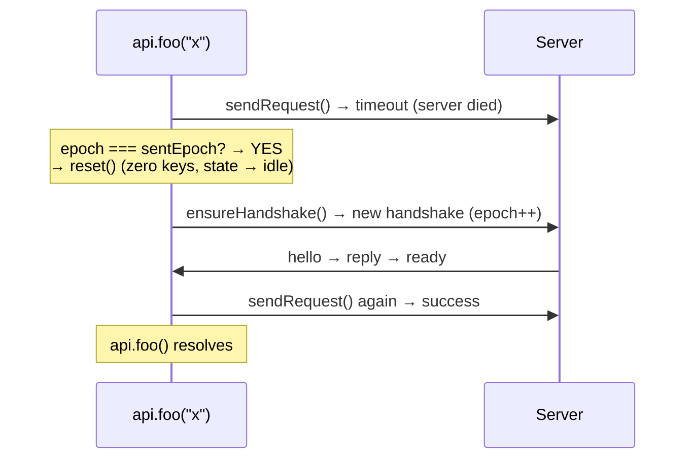
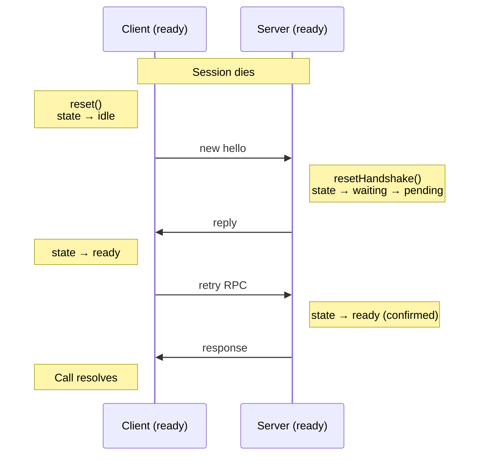

# API Reference

## `chain()` — Procedure Builder

```typescript
import { chain } from "@dotex/erpc/common";
```

`chain()` creates a builder for defining procedures: input, output, middleware, and handler. All methods are chainable.

```typescript
const d = chain();

const procedure = d
  .use(middlewareFn) // add middleware
  .input(zodSchema) // validate and type input
  .output(zodSchema) // validate and type output
  .handler(async ({ ctx, input }) => result); // terminal handler
```

`.handler()` terminates the chain and returns a frozen `Procedure` object.

## `server(router, channel, options)`

Creates a server that listens on the given channel. Returns `{ destroy }`.

```typescript
import { server } from "@dotex/erpc/server";

const { destroy } = server(router, channel, {
  psk,
  context: () => ({ token: getCurrentToken() }),
  onError: console.error,
});
```

### Server Options

| Parameter          | Type                        | Default      | Description                        |
| ------------------ | --------------------------- | ------------ | ---------------------------------- |
| `psk`              | `Uint8Array`                | **required** | Pre-shared key, minimum 32 bytes   |
| `context`          | `() => Ctx \| Promise<Ctx>` | —            | Per-request context factory        |
| `handshakeTimeout` | `number`                    | `5000`       | Handshake timeout (ms)             |
| `maxMessageBytes`  | `number`                    | `1048576`    | Max message size (1 MB)            |
| `onError`          | `(err: unknown) => void`    | —            | Callback for handshake/send errors |

## `client<Router>(channel, options)`

Creates a client. Returns `{ api, destroy }`.

```typescript
import { client } from "@dotex/erpc/client";

const { api, destroy } = client<typeof router>(clientChannel, {
  psk,
  timeout: 10000,
});
```

### Client Options

| Parameter          | Type         | Default      | Description                      |
| ------------------ | ------------ | ------------ | -------------------------------- |
| `psk`              | `Uint8Array` | **required** | Pre-shared key, minimum 32 bytes |
| `timeout`          | `number`     | `10000`      | Per-call timeout (ms)            |
| `maxPending`       | `number`     | `256`        | Max concurrent in-flight calls   |
| `handshakeTimeout` | `number`     | `5000`       | Handshake timeout (ms)           |
| `maxMessageBytes`  | `number`     | `1048576`    | Max message size (1 MB)          |

The `api` proxy triggers the handshake lazily on first call. Client creation is synchronous — no `await` needed.

## `Channel` Interface

Any transport must implement this interface:

```typescript
interface Channel {
  send(data: Uint8Array): void | Promise<void>;
  receive(cb: (data: Uint8Array) => void): () => void; // returns unsubscribe
}
```

`send` transmits binary data. `receive` subscribes to incoming data and returns an unsubscribe function. See [Integrations](integrations.md) for ready-made adapters.

## Errors

```typescript
import { RPCError, RemoteRPCError } from "@dotex/erpc/common";
```

Two error types:

- **`RPCError`** — local error (timeout, session lost, client/handshake failure)
- **`RemoteRPCError`** — error from the remote peer (extends `RPCError`). Contains `code`, `message`, `data`

### Error Handling

```typescript
try {
  await api.foo(input);
} catch (err) {
  if (err instanceof RemoteRPCError) {
    // Server returned an error — err.code, err.message, err.data
  } else if (err instanceof RPCError) {
    // Local failure — timeout, session lost, etc.
  }
}
```

## Middleware & Context

Middleware lets you add logic before the handler runs — authentication, logging, data transformation. Chain middleware with `.use()`. Each middleware can extend the context.

```typescript
import { chain, RPCError } from "@dotex/erpc/common";

const d = chain();

const authProcedure = d.use(async ({ ctx, input, next }) => {
  const user = await getUser(ctx.token);
  if (!user) throw new RPCError("UNAUTHORIZED", "Bad token");
  return next({ user }); // merges { user } into ctx
});

const router = {
  getProfile: authProcedure
    .input(z.object({ id: z.string() }))
    .handler(async ({ ctx, input }) => {
      // ctx.user is available here
      return db.getProfile(input.id);
    }),
};
```

Set the base context on the server via `context`:

```typescript
server(router, channel, {
  psk,
  context: () => ({ token: getCurrentToken() }),
});
```

The `context` factory is called **on every request**, so the context is always fresh.

## Auto-Retry

When an RPC call fails due to a timeout or send error, the client automatically retries once with a fresh handshake:



Concurrent calls that fail at the same time **share a single handshake** via epoch check — reset happens only once.

### Retry Rules

- `RemoteRPCError` (server responded with an error) — **no retry**, thrown immediately
- `destroy()` was called — **no retry**, thrown immediately
- Retry happens **exactly once** per call — no infinite loops
- Only the first failed call triggers reset; others piggyback on the new handshake

## Re-Handshake

The server accepts a new hello even when already in `ready` state. This enables transparent session refresh:



## Cleanup

Always call `destroy()` when you're done:

```typescript
const { destroy: destroyServer } = server(router, channel, { psk });
const { api, destroy: destroyClient } = client<typeof router>(channel, { psk });

// When shutting down:
destroyClient(); // rejects all pending calls, zeros keys
destroyServer(); // zeros keys, unsubscribes from channel
```

After `destroy()`, any call throws `RPCError("SESSION", "Session destroyed")`.

## Edge Runtime Compatibility

Both `server()` and `client()` return **synchronously**. No top-level `await`. Pure JavaScript dependencies. This means eRPC works in environments with async initialization restrictions:

- Cloudflare Workers / Durable Objects
- Deno Deploy
- Vercel Edge Functions
- Service Workers
- React Native
