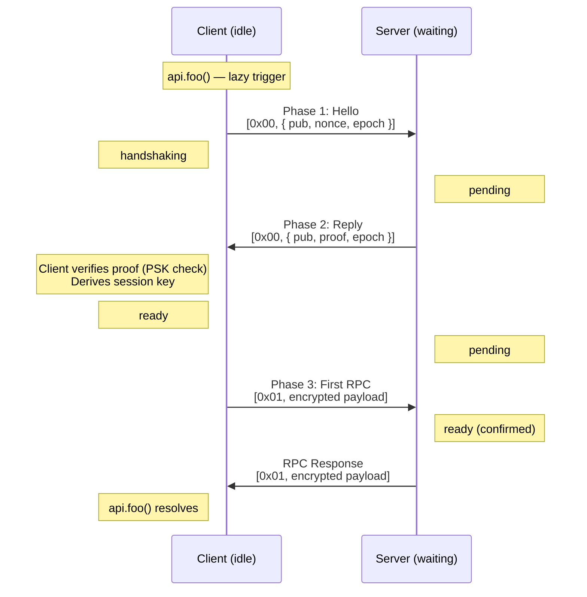
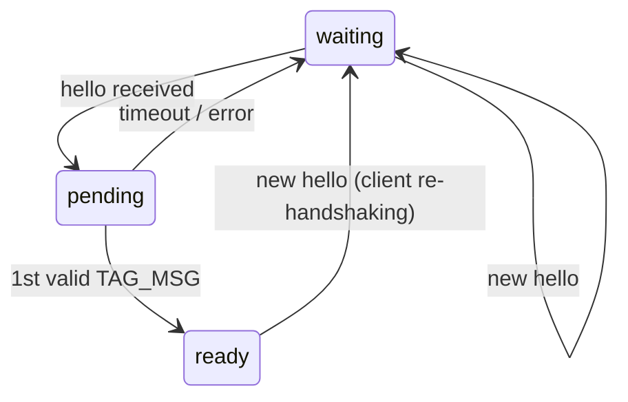
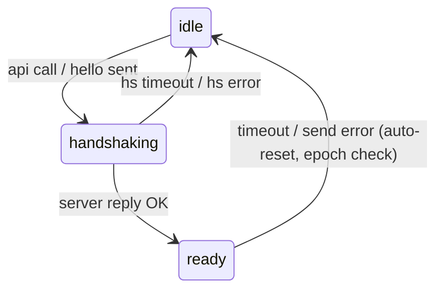

# Security

## Threat Model

eRPC treats the transport channel as **untrusted**. An attacker may:

- Read all messages (eavesdrop)
- Inject messages (forge)
- Replay captured messages
- Drop or reorder messages

eRPC does **not** protect against denial of service — if the attacker drops all messages, communication is impossible.

## Security Properties

| Property | Mechanism |
|----------|-----------|
| Confidentiality | XSalsa20-Poly1305 AEAD per message |
| Authentication | PSK mixed into HKDF key derivation |
| Server identity | HMAC proof in handshake reply |
| Client identity | Implicit — wrong PSK produces invalid ciphertext |
| Forward secrecy | Fresh ephemeral X25519 keys per session |
| Replay (handshake) | Random nonce bound into HMAC proof |
| Replay (session) | Random 24-byte nonces per message |
| Stale responses | Epoch counter in hello/reply |
| Prototype pollution | `sanitize()` strips `__proto__`, `constructor`, `prototype` |
| Type confusion | msgpack extension types disabled |

## PSK (Pre-Shared Key)

The PSK is **never sent over the wire**. It's used as the HKDF salt, so even if an attacker observes the full X25519 exchange, they cannot derive the session key without knowing the PSK.

**Reusing a PSK across sessions is safe.** Each session generates fresh ephemeral X25519 keys. Different ephemeral keys mean a different raw shared secret and a different session key — even with the same PSK salt.

## Handshake

The handshake is lazy — it starts automatically on the first `api` call.

**Three phases:**

1. **Hello** — the client sends its ephemeral public key, a random nonce, and an epoch counter
2. **Reply** — the server responds with its public key and an HMAC proof, confirming knowledge of the PSK
3. **First RPC** — the client sends an encrypted call. The server transitions to `ready` only upon successful decryption — this implicitly proves the client also knows the PSK

## State Machines

### Server

### Client

## Replay Within a Session

eRPC uses random nonces (not counters) for XSalsa20-Poly1305. With 24-byte (192-bit) random nonces, collision probability is negligible. However, a captured ciphertext **can** be replayed if the attacker can inject into the channel while the session is alive — the replayed message will decrypt and execute again.

For non-idempotent operations, add application-level idempotency keys.
