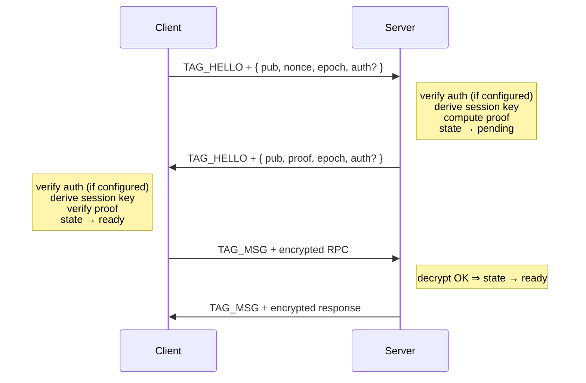

# Protocol

A complete, language-agnostic specification of the eRPC wire protocol. Read this if you want to port eRPC to another language, audit the security, or build a compatible implementation. Everything below is normative.

The reference implementation is TypeScript. This document is the contract; the code follows it.

## Goals and non-goals

Design constraints, in order:

1. **Encrypted by default.** No "plaintext mode."
2. **Lazy.** No work happens until the application makes a call. `client()` and `server()` return synchronously.
3. **Resilient.** Either side can fail and re-handshake without coordination from the application.
4. **Transport-agnostic.** The protocol must work over any byte-pipe: duplex socket, message pair, broadcast bus.
5. **No long-lived state in the protocol.** Secret rotation, key revocation, replay caches: application concerns.

Non-goals: in-protocol streaming RPCs, multiplexing over a single channel, formal session tickets, ordering guarantees beyond what the transport provides.

## Primitives

| Primitive | Algorithm | Notes |
|-----------|-----------|-------|
| Key exchange | X25519 | 32-byte keys |
| Symmetric encryption | XSalsa20-Poly1305 (AEAD) | 24-byte nonce, 32-byte key, 16-byte tag |
| Hash | SHA-256 | — |
| Key derivation | HKDF-Extract+Expand-SHA-256 | RFC 5869 |
| MAC | HMAC-SHA-256 | RFC 2104 |
| Serialization | msgpack | All extension types **disabled** (see Sanitization) |

All wire numbers are network-byte-order (big-endian) unless explicitly noted.

## Constant reference

| Name | Value | Purpose |
|------|-------|---------|
| `NONCE_LEN` | 24 | XSalsa20-Poly1305 nonce length (per encrypted message) |
| `KEY_LEN` | 32 | Symmetric session key length, X25519 key length, **client hello nonce length** |
| `TAG_HELLO` | `0x00` | First byte of a handshake frame |
| `TAG_MSG` | `0x01` | First byte of an encrypted RPC frame |
| `MAX_HELLO_BYTES` | 65,536 | Max size of a handshake frame (post-tag) |
| `MAX_AUTH_BYTES` | 32,768 | Max size of the optional `auth` payload |
| `MAX_MSG_BYTES` | 1,048,576 | Max size of an encrypted RPC frame (configurable) |
| `HANDSHAKE_TIMEOUT_MS` | 5,000 | Default timeout for completing the handshake |
| `RPC_TIMEOUT_MS` | 10,000 | Default per-call timeout (client side) |
| `MAX_PENDING` | 256 | Default maximum in-flight RPCs per client |
| `KDF_INFO` | UTF-8 bytes of `"drpc-v1"` | HKDF info parameter for session key |
| `PSK_DERIVE_INFO` | UTF-8 bytes of `"erpc-session-v1"` | HKDF info for `deriveSessionSecret` helper |
| `TRANSCRIPT_HELLO_MAGIC` | UTF-8 bytes of `"erpc-hs-hello-v1\0"` (17 bytes) | Domain separation for client transcript |
| `TRANSCRIPT_REPLY_MAGIC` | UTF-8 bytes of `"erpc-hs-reply-v1\0"` (17 bytes) | Domain separation for server transcript |
| `EMPTY_SECRET` | 32 zero bytes | HKDF salt when no secret is configured (asymmetric-only mode) |

## Frame format

Every wire frame is a single byte tag followed by a payload.

```
frame := tag (1 byte) || payload (...)
```

Two tag values are defined. Implementations **must** drop frames with any other tag.

### `TAG_HELLO = 0x00`

The payload is a msgpack-encoded map. The frame is sent in both handshake directions; the map's shape differs by direction.

**Hello (client → server):**

```
{
  pub:   bin   (32 bytes, X25519 public key)
  nonce: bin   (32 bytes, fresh random)
  epoch: uint  (0..2^32-1)
  auth:  bin   (optional, ≤ MAX_AUTH_BYTES)
}
```

**Reply (server → client):**

```
{
  pub:   bin   (32 bytes, X25519 public key)
  proof: bin   (32 bytes, HMAC-SHA-256 over the transcript message, see Proof)
  epoch: uint  (echo of the client's hello.epoch)
  auth:  bin   (optional, ≤ MAX_AUTH_BYTES)
}
```

A frame whose payload is longer than `MAX_HELLO_BYTES` **must** be dropped without state change. A frame that fails msgpack decoding, or decodes to anything other than a map with the required fields, **must** cause the receiving side to reset its handshake state (and call `onError` if observed by the server).

### `TAG_MSG = 0x01`

The payload is an encrypted RPC message:

```
0x01 || nonce (24 bytes) || ciphertext_with_tag (≥ 16 bytes)
```

The ciphertext is the output of XSalsa20-Poly1305 AEAD with:

- Key: the 32-byte session key (see Key derivation)
- Nonce: the 24 bytes immediately following the tag (fresh random per message)
- Plaintext: msgpack-encoded RPC message (request or response)
- Associated data: none

A frame whose total length exceeds `MAX_MSG_BYTES` **must** be dropped. A frame whose ciphertext fails Poly1305 verification **must** be dropped silently. No error, no state change.

## Handshake

The handshake is one round-trip initiated by the client. It is **lazy**: the client does not send anything until the application makes its first RPC call.



### Step 1: client builds and sends hello

The client generates:

- A fresh X25519 keypair `(c_priv, c_pub)`.
- A fresh 32-byte random nonce `c_nonce`.
- The next epoch value (start at 1; increment on every handshake attempt; wrap modulo 2³²).

If asymmetric `sign` is configured, the client computes the **hello transcript**:

```
hello_transcript :=
    TRANSCRIPT_HELLO_MAGIC ||
    encode_uint32_be(epoch) ||
    c_pub ||
    c_nonce
```

and signs it. The signature payload is opaque to the protocol; its length must be in `1..MAX_AUTH_BYTES`.

The client then sends:

```
0x00 || msgpack({ pub: c_pub, nonce: c_nonce, epoch: epoch, auth: signed? })
```

### Step 2: server processes hello

1. Verify frame length and tag.
2. Decode msgpack, sanitize, check shape.
3. If `verify` is configured: require `auth`, build hello transcript, call `verify(auth, transcript)`. On failure, reset handshake state.
4. Compute ECDH shared secret: `raw = X25519(s_priv, c_pub)`.
5. Call `secret()` if configured. If fewer than `KEY_LEN` bytes, fail. If not configured, use `EMPTY_SECRET`.
6. Derive session key: `session_key = HKDF(SHA-256, IKM=raw, salt=psk, info=KDF_INFO, L=KEY_LEN)`.
7. Zero `raw` and PSK bytes.
8. Compute proof: `proof = HMAC-SHA-256(session_key, s_pub || c_pub || c_nonce)`.
9. If `sign` is configured, build **reply transcript** and sign it:

```
reply_transcript :=
    TRANSCRIPT_REPLY_MAGIC ||
    encode_uint32_be(epoch) ||
    c_pub ||
    c_nonce ||
    s_pub
```

10. Set encryptor/decryptor, transition state to `pending`.
11. Send:

```
0x00 || msgpack({ pub: s_pub, proof: proof, epoch: epoch, auth: signed? })
```

The server **does not** transition to `ready` yet. It does so on the first `TAG_MSG` whose Poly1305 tag verifies under the freshly-derived session key, regardless of whether the decrypted payload is a well-formed RPC request. Producing a valid AEAD frame is the implicit proof; the inner shape is checked afterwards and may be silently dropped without rolling state back.

### Step 3: client processes reply

1. Verify frame length and tag.
2. Decode msgpack, sanitize, check shape.
3. Silently drop if `reply.epoch !== this_epoch` (stale reply).
4. If `verify` is configured: require `auth`, build reply transcript, call `verify(auth, transcript)`. On failure, reset handshake state.
5. Compute ECDH shared secret: `raw = X25519(c_priv, s_pub)`.
6. Call `secret()` if configured; otherwise use `EMPTY_SECRET`. Validate ≥ `KEY_LEN` bytes.
7. Derive `session_key` with the same HKDF call as the server.
8. Recompute expected proof: `expected = HMAC-SHA-256(session_key, s_pub || c_pub || c_nonce)`.
9. Compare `expected` to `proof` in **constant time**. Mismatch ⇒ fail.
10. Set encryptor/decryptor, zero intermediate buffers, transition to `ready`.

### Step 4: first encrypted message

The client encrypts and sends its first RPC request. On the server, successful AEAD verification of the first `TAG_MSG` (Poly1305 tag passes under the freshly-derived session key) is the implicit proof that the client knows the secret, and the server transitions from `pending` to `ready`. The inner RPC payload is validated separately. A junk payload that nonetheless decrypts cleanly still confirms the session; it is just dropped without producing a response.

### Re-handshake

A server in **any** state that receives a `TAG_HELLO` resets its handshake state and processes the new hello. The client side does the same on reset. This is how transparent recovery works: a dead session triggers a new hello, the server resets, and the new session is established without application-layer coordination.

## Key derivation

```
session_key = HKDF(
  hash  = SHA-256,
  ikm   = X25519(local_priv, remote_pub),
  salt  = secret_or_EMPTY_SECRET,
  info  = KDF_INFO,                // "drpc-v1"
  L     = KEY_LEN,                 // 32
)
```

The secret is the **salt** parameter, not the IKM. This is deliberate: the salt parameter is what HKDF uses for domain separation and authentication.

If both endpoints derive the same `secret` and the X25519 exchange is intact, both arrive at the same `session_key`. An attacker who runs the X25519 exchange but lacks the secret derives a different key and the HMAC proof fails.

When `secret` is not configured (asymmetric-only mode), `secret_or_EMPTY_SECRET` is 32 zero bytes. RFC 5869 allows an all-zero salt; in this mode session authentication relies entirely on the `sign`/`verify` callbacks. The reference implementation refuses an application-supplied `secret()` that returns 32 zeros, so a misconfigured secret never silently degrades into the asymmetric-only mode.

### `deriveSessionSecret` (helper)

Optional convenience for binding the secret to a per-session identifier:

```
deriveSessionSecret(sessionId, secret) := HKDF(
  hash = SHA-256,
  ikm  = secret,                  // ≥ 32 bytes
  salt = utf8(sessionId),         // non-empty
  info = PSK_DERIVE_INFO,         // "erpc-session-v1"
  L    = KEY_LEN,                 // 32
)
```

The protocol does not require its use.

## Proof

```
proof = HMAC-SHA-256(
  key  = session_key,
  data = s_pub || c_pub || c_nonce,
)
```

The proof binds the session key to the specific ephemeral keys and nonce of this handshake. It is sent by the server in the reply and verified by the client in constant time.

The proof does **not** include the epoch directly. Replay across epochs is prevented because fresh ephemeral keys produce a different `raw`, a different `session_key`, and therefore a different proof.

## Encryption

Per-message encryption:

```
nonce       = random_bytes(24)
plaintext   = msgpack_encode(message)
ciphertext  = XSalsa20-Poly1305-encrypt(session_key, nonce, plaintext, AD=∅)
frame       = 0x01 || nonce || ciphertext
```

Per-message decryption:

```
require frame[0] == 0x01
require len(frame) ≤ MAX_MSG_BYTES
nonce       = frame[1 : 25]
ciphertext  = frame[25 : ]
plaintext   = XSalsa20-Poly1305-decrypt(session_key, nonce, ciphertext, AD=∅)
   on failure: drop silently
message     = sanitize(msgpack_decode(plaintext))
```

A 24-byte random nonce gives 192 bits of entropy. Collisions are negligible for any realistic message volume. eRPC does **not** use a counter. The trade-off: slightly higher nonce size in exchange for stateless encoding and tolerance for out-of-order or duplicated transport delivery.

## RPC message format

After decryption, an RPC message is a msgpack-encoded map. Two kinds.

### Request (client → server)

```
{
  t:  1,
  id: string,   // non-empty, unique within this client session
  p:  string,   // procedure name
  i:  any,      // input (validated against procedure's .input schema)
}
```

### Response (server → client)

```
// Success
{
  t:  2,
  id: <echo of request id>,
  ok: true,
  d:  any,      // handler output (validated against .output schema)
  e:  null,
}

// Failure
{
  t:  2,
  id: <echo of request id>,
  ok: false,
  d:  null,
  e:  { c: string, m: string, d: any },
}
```

The error map's fields:

| Field | Meaning |
|-------|---------|
| `c` | Error code. Strings like `"INPUT_VALIDATION"`, `"NOT_FOUND"`, `"UNAUTHORIZED"`, or any application-defined string. |
| `m` | Human-readable message. Untrusted from the receiver's perspective. |
| `d` | Optional structured data, sanitized before transmission. |

Messages with wrong `t`, missing/empty `id`, missing/empty `p`, or any unexpected type **must** be dropped silently. The protocol has no provision for "bad message" responses. Those would be useful only to an attacker enumerating implementation behavior.

## State machines

### Server

```
[waiting]
   │  receive TAG_HELLO (good)
   ▼
[pending] ──── 1st valid TAG_MSG ───────► [ready]
   │              ▲
   │              │  receive TAG_HELLO
   │ timeout      │
   │ error        │
   ▼              │
[waiting]  ◄──────┘  (resetHandshake — accept new handshake even from ready)

destroy() ⇒ [destroyed], terminal
```

### Client

```
[idle]
   │  api call
   ▼
[handshaking]
   │  reply OK + proof OK
   ▼
[ready]
   │  call timeout / send error
   ▼
[idle]  (auto-reset, retry once on next call)

destroy() ⇒ [closed], terminal
```

The client uses an **epoch counter** to coordinate concurrent failure-and-retry. When multiple calls fail at once, only the first one increments the epoch and resets; the rest see the new epoch and join the in-progress handshake.

## Auto-retry semantics

When a call fails with a local `TIMEOUT` or send error on a `ready` session:

1. If `epoch === sentEpoch` (no other call has already reset), call `reset()`: zero the session key, drop encryptor/decryptor, state ← `idle`.
2. Call `ensureHandshake()`. If `state === handshaking`, await the existing promise; otherwise start a new handshake.
3. Once `ready`, resend the original request **once**.
4. If that also fails, surface the error. No further retries.

Calls that received a `RemoteRPCError` (the server responded with `ok: false`) are **not** retried. The server is alive and gave a real answer.

## Sanitization

eRPC applies a strict sanitization pass to every decoded msgpack value, both inbound and outbound (on error payloads). Any of the following causes the protocol to reject the message:

1. Recursion depth greater than 32 ⇒ `INVALID_DATA`.
2. Any msgpack extension type, **including the built-in Timestamp (type -1)** ⇒ `INVALID_DATA`. The Timestamp extension is explicitly rejected because msgpack libraries hard-code its decoder.
3. Any object whose prototype is neither `Object.prototype` nor `null`. This rejects `Date`, `Map`, `Set`, `ExtData`, and any host object that arrived through an unexpected codec path.
4. Object keys equal to `"__proto__"`, `"constructor"`, or `"prototype"` are stripped during traversal.

`Uint8Array` (msgpack `bin`) is preserved. `BigInt64` is decoded as JavaScript `BigInt`. Plain objects are rebuilt with `Object.create(null)` so prototype chains cannot be re-poisoned downstream.

A port to a language without prototype pollution should still:

- Reject extension types it does not know about.
- Limit recursion depth.
- Reject inputs whose structure does not match the expected shape.

## Authorization data flow

When `auth.verify` is configured on the server, the value it returns is the verified principal for the lifetime of the session. eRPC takes the returned `{ auth: ... }` object, sanitizes it, and:

- Stores it on the server session.
- Passes it as `{ auth: verified }` to the `context` factory on every request.
- Discards it on any reset (timeout, new hello, destroy).

```
server.verify(hello.auth, hello_transcript)
    → { auth: { userId, ... } }
        │
        ▼
on each request:
    ctx = context({ auth: verified })
        │
        ▼
    procedure runs with ctx
```

Clients can also configure `verify`. On the client side the return value is unused. Success is signaled by not throwing.

## Failure modes

| Failure | Server response | Client response |
|---------|----------------|-----------------|
| Bad frame tag | Drop silently | Drop silently |
| Frame > max size | Drop silently | Drop silently |
| msgpack decode error | Reset, `onError` | Fail handshake |
| Sanitization failure | Reset, `onError` | Fail handshake |
| Bad secret / missing secret bytes | Fail handshake (`HANDSHAKE`), reset | Fail handshake (`HANDSHAKE`) |
| `verify` throws | Fail handshake, reset | Fail handshake |
| `sign` returns invalid payload | Fail handshake | Fail handshake |
| Proof mismatch (client) | — | Fail handshake |
| Poly1305 mismatch (post-handshake) | Drop frame silently | Drop frame silently |
| Stale reply (`epoch` mismatch) | — | Drop reply silently |
| Stale request (after server reset) | Drop response (server-side guard) | Eventually times out, retries |
| RPC handler throws non-`RPCError` | Send `{ c: "INTERNAL", m: "Internal error" }` | Surface as `RemoteRPCError` |

"Drop silently" is deliberate. Any feedback at the wire level would help an attacker probe the implementation.

## Compatibility

- The `auth` field on hello and reply is **optional**. Peers that do not understand it ignore it; peers that need it reject frames that lack it. Secret-only deployments stay wire-compatible with mutual-auth deployments as long as neither side has `verify` configured.
- The transcript magic strings (`erpc-hs-hello-v1`, `erpc-hs-reply-v1`) and `KDF_INFO` (`drpc-v1`) are version markers. Any change to transcripts, key derivation inputs, or framing **must** bump these strings. Otherwise an attacker could mix and match versions in a downgrade attack.
- New fields can be added to the request/response messages (`t: 1` and `t: 2` maps). Implementations **must** ignore unknown fields. They **must not** accept messages with wrong `t` or missing required fields.

## Implementation checklist

A new-language port that ticks all of these is conformant:

- [ ] Constants match the table above exactly.
- [ ] X25519, XSalsa20-Poly1305, HKDF-SHA-256, HMAC-SHA-256 implementations are constant-time where the spec requires (proof comparison, MAC verification).
- [ ] The X25519 implementation rejects RFC 7748 §6.1 low-order public keys (or the application layer rejects them before `getSharedSecret`). Accepting them in asymmetric-only mode lets an active MITM force a deterministic all-zero ECDH output and decrypt the session. See [Security § Ephemeral key validity](security.md#ephemeral-key-validity).
- [ ] msgpack codec rejects all extension types; built-in Timestamp explicitly.
- [ ] Sanitization rejects host objects (or the language equivalent of "weird types"), strips prototype-pollution keys, limits depth.
- [ ] Handler output is also sanitized (or otherwise restricted to plain-data trees) before encoding, so a stray host object surfaces as `INVALID_DATA` and not an opaque `INTERNAL`.
- [ ] Frames are bounded by `MAX_HELLO_BYTES` / `MAX_MSG_BYTES`.
- [ ] Hello transcript and reply transcript are built from the exact byte sequences shown.
- [ ] Auth is processed **before** any session key is materialized; failed auth never leaks session state.
- [ ] Server transitions to `ready` only on first valid decrypt, not on sending the reply.
- [ ] Epoch counter increments per handshake attempt on both sides and is echoed in the reply.
- [ ] The epoch counter is bumped for **every** incoming hello, including ones that arrive while a previous attempt is still suspended at an `await`. In-flight stale attempts detect themselves via the epoch guard and abandon all writes.
- [ ] Every `await` in the handshake path is followed by an epoch + destroyed guard before any module-level state is written. Module-level publishes happen under a final guard inside a synchronous block.
- [ ] Secret bytes equal to `EMPTY_SECRET` (32 zero bytes) are rejected at runtime when `auth.secret` is configured.
- [ ] The X25519 raw shared secret is zeroed in a try/finally so a thrown `psk()` does not leak it.
- [ ] Ephemeral private keys captured for the duration of an `await` are owned by the in-flight attempt (copied, not aliased), so a concurrent reset that zeroes the live buffer does not corrupt the in-flight derivation.
- [ ] Server accepts new hellos in any state (including `ready`); doing so resets the current session before processing.
- [ ] Client auto-retries exactly once per call on `TIMEOUT` / send error; never on `RemoteRPCError`.
- [ ] Ephemeral keys, raw shared secrets, and session keys are zeroed on reset and destroy.
- [ ] The proof is verified in constant time.
- [ ] No information is sent back to a peer that sends a malformed frame.

If all these hold and the test vectors below pass, two implementations interoperate.

## Test vectors

The reference implementation's `test/security` and `test/unit` directories contain canonical fixtures: known `(c_priv, c_pub, c_nonce, s_priv, s_pub, secret)` inputs and the resulting `session_key` and `proof`. Use those to validate a port at the byte level before running end-to-end interop tests over a real channel.
