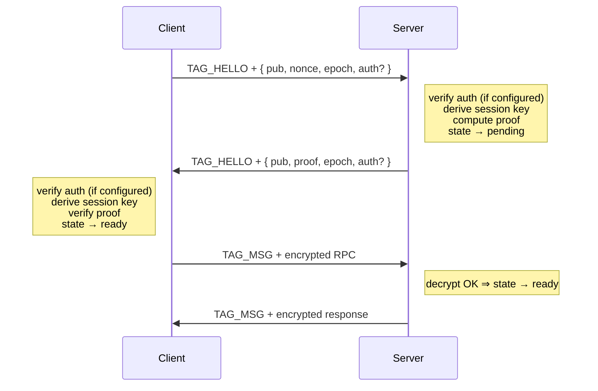

# Protocol

Language-agnostic specification of the Safe RPC wire protocol. Read this to port Safe RPC, audit it, or build a compatible implementation. Everything below is normative.

The reference implementation is in TypeScript, but this document is the contract — the code follows it.

## Goals and non-goals

Design constraints, in order:

1. **Encrypted by default.** No "plaintext mode."
2. **Lazy.** No work happens until the application makes a call. `client()` and `server()` return synchronously.
3. **Resilient.** Either side can fail and re-handshake without coordination from the application.
4. **Transport-agnostic.** The protocol must work over any byte-pipe: duplex socket, message pair, broadcast bus.
5. **No long-lived state in the protocol.** Secret rotation, key revocation: application concerns. The one exception is the optional bounded seen-nonce set (see Replay protection) — per-session, bounded, and dropped with the session.

Non-goals: streaming RPCs in-protocol, multiplexing over a single channel, formal session tickets, ordering guarantees stronger than what the transport provides.

## Primitives

| Primitive            | Algorithm                   | Notes                                               |
| -------------------- | --------------------------- | --------------------------------------------------- |
| Key exchange         | X25519                      | 32-byte keys                                        |
| Symmetric encryption | XSalsa20-Poly1305 (AEAD)    | 24-byte nonce, 32-byte key, 16-byte tag             |
| Hash                 | SHA-256                     | —                                                   |
| Key derivation       | HKDF-Extract+Expand-SHA-256 | RFC 5869                                            |
| MAC                  | HMAC-SHA-256                | RFC 2104                                            |
| Serialization        | msgpack                     | All extension types **disabled** (see Sanitization) |

All wire numbers are network-byte-order (big-endian) unless explicitly noted.

## Constant reference

| Name                     | Value                                               | Purpose                                                                        |
| ------------------------ | --------------------------------------------------- | ------------------------------------------------------------------------------ |
| `NONCE_LEN`              | 24                                                  | XSalsa20-Poly1305 nonce length (per encrypted message)                         |
| `KEY_LEN`                | 32                                                  | Symmetric session key length, X25519 key length, **client hello nonce length** |
| `TAG_HELLO`              | `0x00`                                              | First byte of a handshake frame                                                |
| `TAG_MSG`                | `0x01`                                              | First byte of an encrypted RPC frame                                           |
| `MAX_HELLO_BYTES`        | 65,536                                              | Max size of a handshake frame, **tag byte included**                           |
| `MAX_AUTH_BYTES`         | 32,768                                              | Max size of the optional `auth` payload                                        |
| `MAX_MSG_BYTES`          | 1,048,576                                           | Max size of an encrypted RPC frame (configurable)                              |
| `HANDSHAKE_TIMEOUT_MS`   | 5,000                                               | Default timeout for completing the handshake                                   |
| `RPC_TIMEOUT_MS`         | 10,000                                              | Default per-call timeout (client side)                                         |
| `MAX_PENDING`            | 256                                                 | Default maximum in-flight RPCs per client                                      |
| `MAX_ID_LEN`             | 64                                                  | Max request `id` length accepted by the server                                 |
| `PROOF_LEN`              | 32                                                  | Length of the HMAC proof in the reply                                          |
| `REPLAY_WINDOW`          | 4,096                                               | Default seen-nonce set capacity (see Replay protection)                        |
| `KDF_INFO`               | UTF-8 bytes of `"saferpc-v1"`                       | HKDF info parameter for session key                                            |
| `PSK_DERIVE_INFO`        | UTF-8 bytes of `"saferpc-session-v1"`               | HKDF info for `deriveSessionSecret` helper                                     |
| `TRANSCRIPT_HELLO_MAGIC` | UTF-8 bytes of `"saferpc-hs-hello-v1\0"` (20 bytes) | Domain separation for client transcript                                        |
| `TRANSCRIPT_REPLY_MAGIC` | UTF-8 bytes of `"saferpc-hs-reply-v1\0"` (20 bytes) | Domain separation for server transcript                                        |
| `EMPTY_SECRET`           | 32 zero bytes                                       | HKDF salt when no secret is configured (asymmetric-only mode)                  |

## Frame format

Every wire frame is a single byte tag followed by a payload.

```
frame := tag (1 byte) || payload (...)
```

Two tag values are defined. Implementations **must** drop frames with any other tag.

All frame-size limits in this document are compared against the **full frame length, tag byte included**: a hello frame is dropped when `len(frame) > MAX_HELLO_BYTES`, an RPC frame when `len(frame) > MAX_MSG_BYTES`. (The effective payload maximum is therefore one byte less than the constant.) Ports must use the same comparison or byte-exact conformance tests at the boundary will disagree.

### `TAG_HELLO = 0x00`

The payload is a msgpack-encoded map. The frame is sent in both handshake directions; the map's shape differs by direction.

**Hello (client → server):**

```
{
  pub:   bin   (32 bytes, X25519 public key)
  nonce: bin   (32 bytes, fresh random)
  epoch: uint  (0..2^32-1)
  auth:  bin   (optional, ≤ MAX_AUTH_BYTES)
}
```

**Reply (server → client):**

```
{
  pub:   bin   (32 bytes, X25519 public key)
  proof: bin   (32 bytes, HMAC-SHA-256 over the transcript message, see Proof)
  epoch: uint  (echo of the client's hello.epoch)
  auth:  bin   (optional, ≤ MAX_AUTH_BYTES)
}
```

A frame longer than `MAX_HELLO_BYTES` (tag included) **must** be dropped without state change. A frame that fails msgpack decoding, or decodes to anything other than a map with the required fields, **must** fail the handshake _attempt_ it belongs to (and call `onError` if observed by the server). On the server an invalid hello **must not** disturb an established session — see Re-handshake.

### `TAG_MSG = 0x01`

The payload is an encrypted RPC message:

```
0x01 || nonce (24 bytes) || ciphertext_with_tag (≥ 16 bytes)
```

The ciphertext is the output of XSalsa20-Poly1305 AEAD with:

- Key: the 32-byte session key (see Key derivation)
- Nonce: the 24 bytes immediately following the tag (fresh random per message)
- Plaintext: msgpack-encoded RPC message (request or response)
- Associated data: none

A frame whose total length exceeds `MAX_MSG_BYTES` **must** be dropped. A frame whose ciphertext fails Poly1305 verification **must** be dropped silently. No error, no state change.

## Handshake

The handshake is one round-trip initiated by the client, and it is **lazy** - nothing goes on the wire until the application makes its first RPC call.


```mermaid
sequenceDiagram
    Client->>Server: TAG_HELLO + { pub, nonce, epoch, auth? }
    Note right of Server: verify auth (if configured)<br/>derive session key<br/>compute proof<br/>state → pending
    Server->>Client: TAG_HELLO + { pub, proof, epoch, auth? }
    Note left of Client: verify auth (if configured)<br/>derive session key<br/>verify proof<br/>state → ready
    Client->>Server: TAG_MSG + encrypted RPC
    Note right of Server: decrypt OK ⇒ state → ready
    Server->>Client: TAG_MSG + encrypted response
```

### Step 1: client builds and sends hello

The client generates:

- A fresh X25519 keypair `(c_priv, c_pub)`.
- A fresh 32-byte random nonce `c_nonce`.
- The next epoch value: start at 1, increment on every handshake attempt. Epochs are unsigned 32-bit; values outside `0..2^32-1` are invalid on the wire and **must** be rejected. The counter does not wrap — an implementation that exhausts it (2³² handshake attempts in one client lifetime) must fail the handshake with a terminal error rather than reuse epoch values. Recreating the client resets the counter safely: epochs only disambiguate attempts within one client instance.

If asymmetric `sign` is configured, the client computes the **hello transcript**:

```
hello_transcript :=
    TRANSCRIPT_HELLO_MAGIC ||
    encode_uint32_be(epoch) ||
    c_pub ||
    c_nonce
```

and signs it. The signature payload is opaque to the protocol; its length must be in `1..MAX_AUTH_BYTES`.

The client then sends:

```
0x00 || msgpack({ pub: c_pub, nonce: c_nonce, epoch: epoch, auth: signed? })
```

### Step 2: server processes hello

The server processes the hello as an **attempt**, on state local to that attempt — a fresh ephemeral pair `(s_priv, s_pub)` generated for this hello. An established session, if any, keeps serving while the attempt runs and is replaced only at step 10. A failure at any step discards the attempt's local state and leaves the established session untouched.

1. Verify frame length and tag.
2. Decode msgpack, sanitize, check shape. Validate `epoch` is an integer in `0..2^32-1`.
3. If `verify` is configured: require `auth` (`1..MAX_AUTH_BYTES` bytes), build hello transcript, call `verify(auth, transcript)`. On failure, discard the attempt.
4. Compute ECDH shared secret: `raw = X25519(s_priv, c_pub)`.
5. Call `secret()` if configured. If fewer than `KEY_LEN` bytes, or equal to `EMPTY_SECRET`, fail. If not configured, use `EMPTY_SECRET`.
6. Derive session key: `session_key = HKDF(SHA-256, IKM=raw, salt=psk, info=KDF_INFO, L=KEY_LEN)`.
7. Zero `raw`. **Do not zero or mutate the secret bytes** — the application owns that buffer, and callers legitimately return the same buffer on every handshake (`secret: () => sharedSecret`).
8. Compute proof: `proof = HMAC-SHA-256(session_key, s_pub || c_pub || c_nonce)`.
9. If `sign` is configured, build **reply transcript** and sign it:

```
reply_transcript :=
    TRANSCRIPT_REPLY_MAGIC ||
    encode_uint32_be(epoch) ||
    c_pub ||
    c_nonce ||
    s_pub
```

10. **Publish atomically**: zero the previous session key (if any), install the new `session_key`/encryptor/decryptor and the verified auth data, transition state to `pending`. This publish must be a single synchronous block guarded by the attempt's epoch, so a concurrent newer hello cannot interleave.
11. Send:

```
0x00 || msgpack({ pub: s_pub, proof: proof, epoch: epoch, auth: signed? })
```

The server **does not** transition to `ready` yet. It does so on the first `TAG_MSG` whose Poly1305 tag verifies under the freshly-derived session key, regardless of whether the decrypted payload is a well-formed RPC request. Producing a valid AEAD frame is the implicit proof; the inner shape is checked afterwards and may be silently dropped without rolling state back.

### Step 3: client processes reply

1. Verify frame length and tag.
2. Decode msgpack, sanitize, check shape.
3. Silently drop if `reply.epoch !== this_epoch` (stale reply).
4. If `verify` is configured: require `auth`, build reply transcript, call `verify(auth, transcript)`. On failure, reset handshake state.
5. Compute ECDH shared secret: `raw = X25519(c_priv, s_pub)`.
6. Call `secret()` if configured; otherwise use `EMPTY_SECRET`. Validate ≥ `KEY_LEN` bytes.
7. Derive `session_key` with the same HKDF call as the server.
8. Recompute expected proof: `expected = HMAC-SHA-256(session_key, s_pub || c_pub || c_nonce)`.
9. Compare `expected` to `proof` in **constant time**. Mismatch ⇒ fail.
10. Set encryptor/decryptor, zero intermediate buffers, transition to `ready`.

### Step 4: first encrypted message

The client encrypts and sends its first RPC request. On the server, successful AEAD verification of the first `TAG_MSG` (Poly1305 tag passes under the freshly-derived session key) is the implicit proof that the client knows the secret, and the server transitions from `pending` to `ready`. The inner RPC payload is validated separately. A junk payload that nonetheless decrypts cleanly still confirms the session; it is just dropped without producing a response.

### Re-handshake

A server in **any** state that receives a `TAG_HELLO` opens a new handshake _attempt_ and processes it — this is how transparent recovery works: a client whose session died sends a fresh hello and gets a fresh session without application-layer coordination.

The established session, if one exists, **must survive until the new attempt succeeds** (step 10 above). An invalid hello — malformed, oversized auth, failed `verify`, bad secret — discards only the attempt. This ordering is load-bearing: without it, a single injected garbage hello (no authentication required) tears down a live session, handing any traffic injector a trivial denial-of-service. With it, a deployment with `verify` configured cannot have its sessions displaced by an attacker who cannot produce a valid signature.

Residual (accepted): in secret-only mode nothing in the hello itself is authenticated, so a _well-formed_ forged hello still opens an attempt that reaches step 10 and displaces the session. Rate-limit hellos at the transport layer if that matters for your deployment.

Each incoming hello **must** invalidate any prior in-flight attempt (bump the attempt counter/epoch before any `await`-equivalent suspension), so stale suspended attempts detect the change and abandon all writes.

## Key derivation

```
session_key = HKDF(
  hash  = SHA-256,
  ikm   = X25519(local_priv, remote_pub),
  salt  = secret_or_EMPTY_SECRET,
  info  = KDF_INFO,                // "saferpc-v1"
  L     = KEY_LEN,                 // 32
)
```

The secret is the **salt** parameter, not the IKM. This is deliberate: the salt parameter is what HKDF uses for domain separation and authentication.

If both endpoints derive the same `secret` and the X25519 exchange is intact, both arrive at the same `session_key`. An attacker who runs the X25519 exchange but lacks the secret derives a different key and the HMAC proof fails.

When `secret` is not configured (asymmetric-only mode), `secret_or_EMPTY_SECRET` is 32 zero bytes. RFC 5869 allows an all-zero salt; in this mode session authentication relies entirely on the `sign`/`verify` callbacks. The reference implementation refuses an application-supplied `secret()` that returns 32 zeros, so a misconfigured secret never silently degrades into the asymmetric-only mode.

### `deriveSessionSecret` (helper)

Optional convenience for binding the secret to a per-session identifier:

```
deriveSessionSecret(sessionId, secret) := HKDF(
  hash = SHA-256,
  ikm  = secret,                  // ≥ 32 bytes
  salt = utf8(sessionId),         // non-empty
  info = PSK_DERIVE_INFO,         // "saferpc-session-v1"
  L    = KEY_LEN,                 // 32
)
```

The protocol does not require its use.

## Proof

```
proof = HMAC-SHA-256(
  key  = session_key,
  data = s_pub || c_pub || c_nonce,
)
```

The proof binds the session key to the specific ephemeral keys and nonce of this handshake. It is sent by the server in the reply and verified by the client in constant time.

The proof does **not** include the epoch directly. Replay across epochs is prevented because fresh ephemeral keys produce a different `raw`, a different `session_key`, and therefore a different proof.

## Encryption

Per-message encryption:

```
nonce       = random_bytes(24)
plaintext   = msgpack_encode(message)
ciphertext  = XSalsa20-Poly1305-encrypt(session_key, nonce, plaintext, AD=∅)
frame       = 0x01 || nonce || ciphertext
```

Per-message decryption:

```
require frame[0] == 0x01
require len(frame) ≤ MAX_MSG_BYTES
nonce       = frame[1 : 25]
ciphertext  = frame[25 : ]
plaintext   = XSalsa20-Poly1305-decrypt(session_key, nonce, ciphertext, AD=∅)
   on failure: drop silently
message     = sanitize(msgpack_decode(plaintext))
```

A 24-byte random nonce gives 192 bits of entropy. Collisions are negligible for any realistic message volume. Safe RPC does **not** use a counter. The trade-off: slightly higher nonce size in exchange for stateless encoding and tolerance for out-of-order or duplicated transport delivery.

> **Directionality.** Both directions encrypt under the **same** session key. With random nonces this is safe for confidentiality (no keystream reuse in practice), but it means a captured frame decrypts on _either_ side. The only thing preventing a reflected client request from being accepted by that same client is the message-type check (`t: 1` vs `t: 2`, below). That check is therefore **mandatory, security-relevant, and must run before any other processing of the decrypted payload**. A port that treats it as optional shape validation loses reflection protection entirely. (A future protocol revision may introduce directional keys; any such change bumps the version strings.)

### Replay protection (seen-nonce set)

Random nonces make accidental collision negligible but do nothing against deliberate replay: an attacker who can inject into a live channel can re-deliver a captured `TAG_MSG` frame and it will decrypt and execute again. The seen-nonce set narrows this window.

The **server** (the side that executes requests) keeps a per-session set of the AEAD nonces it has already accepted, with capacity `REPLAY_WINDOW` (default 4,096; `0` disables the mechanism). Exact semantics — all four rules are load-bearing and a port must implement all of them:

1. **Check before decrypt.** On an inbound `TAG_MSG`, if the 24-byte nonce is in the set, drop the frame silently. (Cheap exact-replay rejection, no AEAD work.)
2. **Insert only after successful Poly1305 verification.** A frame that fails to decrypt must **not** add its nonce to the set. Otherwise an attacker who cannot forge ciphertexts can still flood arbitrary nonces, forcing eviction churn and re-opening the window for entries evicted early.
3. **Bounded, FIFO eviction.** When the set holds `REPLAY_WINDOW` entries, inserting a new nonce evicts the oldest. The honest consequence: a replay older than the last `REPLAY_WINDOW` accepted messages executes again — the window is _narrowed_, not closed. Non-idempotent procedures still want an application-level idempotency key.
4. **Cleared on re-handshake.** A new session key makes old nonces unreplayable (AEAD fails under the new key); keeping them wastes the budget. The set's lifetime is the session key's lifetime.

The client does not need a seen-nonce set for security: response `id`s are matched against the pending-call table and each `id` is used once, so a replayed response is dropped at the RPC layer. A client-side set is permitted but adds nothing.

A transport-duplicated frame (duplication is allowed by the channel contract) is absorbed by rule 1 exactly like an attacker replay: the request executes once, the duplicate is dropped.

## RPC message format

After decryption, an RPC message is a msgpack-encoded map. Two kinds.

### Request (client → server)

```
{
  t:  1,
  id: string,   // non-empty, ≤ MAX_ID_LEN, unique within this client session
  p:  string,   // non-empty procedure name
  i:  any,      // input (validated against procedure's .input schema)
}
```

Nuances a port must reproduce:

- The server **must** drop requests whose `id` is empty or longer than `MAX_ID_LEN` (64), and requests whose `p` is missing, non-string, or empty. Drop means silent drop — no response frame.
- When the caller supplies no input, the `i` key is **omitted entirely**, never encoded as nil. msgpack has no `undefined`; encoding an absent input as nil would make an "optional" input schema on the server observe an explicit null instead of an absent value. An absent key must decode back to the language's absent-value representation.
- The reference client generates `id`s from a monotonically increasing per-client counter. This is not normative — any scheme works — but `id`s **must never be reused** within a client instance: uniqueness is what makes response matching (and the client's replay immunity) sound.

### Response (server → client)

```
// Success
{
  t:  2,
  id: <echo of request id>,
  ok: true,
  d:  any,      // handler output (validated against .output schema)
  e:  null,
}

// Failure
{
  t:  2,
  id: <echo of request id>,
  ok: false,
  d:  null,
  e:  { c: string, m: string, d: any },
}
```

The error map's fields:

| Field | Meaning                                                                                                            |
| ----- | ------------------------------------------------------------------------------------------------------------------ |
| `c`   | Error code. Strings like `"INPUT_VALIDATION"`, `"NOT_FOUND"`, `"UNAUTHORIZED"`, or any application-defined string. |
| `m`   | Human-readable message. Untrusted from the receiver's perspective.                                                 |
| `d`   | Optional structured data, sanitized before transmission.                                                           |

The receiving client must treat every error field as hostile and coerce defensively: if `e` is not a map, surface code `"UNKNOWN"` with an empty message; if `c` is not a non-empty string, use `"UNKNOWN"`; if `m` is not a string, use `""`. Never `String()`-coerce arbitrary values into codes — a stringified `undefined`/object makes a misleading code.

On the server, a handler throwing the implementation's typed RPC error maps to `{ c: code, m: message, d: sanitize(data) }`. Any other thrown value maps to `{ c: "INTERNAL", m: "Internal error", d: null }` — internal error details **must not** leak to the peer. If sanitizing `d` itself fails, the response is not sent at all (the client times out); handler error `data` must be a plain-data tree.

Messages with wrong `t`, missing/empty `id`, missing/empty `p`, or any unexpected type **must** be dropped silently. The protocol has no provision for "bad message" responses. Those would be useful only to an attacker enumerating implementation behavior.

## State machines

### Server

```
[waiting]
   │  TAG_HELLO → attempt validates (steps 1-9) → publish
   ▼
[pending] ──── 1st valid TAG_MSG ───────► [ready]
   │                                        │
   │ attempt timeout / attempt error       │  TAG_HELLO → attempt validates
   ▼                                        ▼  → publish replaces session
[waiting]                               [pending] (new session)

A hello received in ANY state opens an attempt. The attempt runs on local
state; the current session (pending or ready) keeps serving and is replaced
only when the attempt publishes. A failed or timed-out attempt changes
nothing except attempt-local state.

destroy() ⇒ [destroyed], terminal
```

### Client

```
[idle]
   │  api call
   ▼
[handshaking]
   │  reply OK + proof OK
   ▼
[ready]
   │  call TIMEOUT / CHANNEL send error
   ▼
[idle]  (auto-reset, NO resend; next call re-handshakes)

destroy()      ⇒ [closed], terminal
abortPending() ⇒ [idle]   (reject in-flight, client stays usable)
```

The client uses an **epoch counter** to coordinate concurrent failure-and-reset. When multiple calls fail at once, only the first one increments the epoch and resets; the rest see the new epoch and join the in-progress handshake.

## Failure handling (no auto-retry)

As of 0.7.0 the client does **not** auto-retry. When a call fails with a local `TIMEOUT` or `CHANNEL` send error on a `ready` session — **and only then**:

1. If `epoch === sentEpoch` (no other call has already reset), call `reset()`: zero the session key, drop encryptor/decryptor, state ← `idle`. The failed call is **not** resent.
2. The error surfaces to the caller with its typed code. The caller — the only party that knows whether the procedure is idempotent — decides whether to retry.

**Why no resend.** A `TIMEOUT` does not prove the server did not execute the request, only that no response arrived in time. Resending after a timeout can silently execute a non-idempotent procedure twice — a first-party double-execution mechanism for fund-moving handlers, layered on top of any attacker replay window. A `CHANNEL` send error means the request provably never left, so it is safe for the _caller_ to retry; the library still defers that choice to the caller so both cases follow one predictable rule.

**Why still reset (without resending).** A desynced peer — e.g. a restarted server that silently drops `TAG_MSG` over a synchronous transport where no channel error is ever raised — would otherwise wedge every future call. Reset keeps healing lazy: the failed call fails, the _next_ call re-handshakes. The trade-off: `reset()` nulls `decrypt`, so replies to _other_ concurrent in-flight calls on the same session are dropped and those calls also fail; give slow procedures a longer per-call `timeout` so they do not share a short default.

Calls that received a `RemoteRPCError` (the server responded with `ok: false`) are **not** reset or retried. The server is alive and gave a real answer.

Local guardrail errors **must not** trigger the reset path either. The `CLIENT` backpressure error (`maxPending` exceeded), id-counter exhaustion, and any other error that does not indicate a dead session leave the session exactly as it was: resetting a healthy session on a guardrail error would tear down the encryption state for every in-flight call, force them into timeout, and re-execute their handlers — double execution with no attacker involved. The reset trigger set is exactly: local per-call `TIMEOUT`, `CHANNEL` send failure. Nothing else.

Concurrent failures share one re-handshake via the epoch counter, so there are no reset storms.

### abortPending

A transport adapter that learns the channel died from an event (`ws.onclose`) at a moment when no `send` is in progress calls `abortPending(err?)`. It rejects every in-flight call and any hello-waiter immediately with a retryable code (`err ?? RPCError("CHANNEL", "Channel down")`), fails an in-progress handshake so waiters do not hang until `handshakeTimeout`, zeros the keys, and returns the client to `idle` — **not** `closed`. The client object keeps its identity; the next call lazily re-handshakes over the revived transport. No-op once `closed`.

## Sanitization

Every decoded msgpack value passes through a sanitization step, inbound and outbound (the latter on error payloads). Any of the following rejects the message:

1. Recursion depth greater than 32 ⇒ `INVALID_DATA`.
2. Any msgpack extension type, **including the built-in Timestamp (type -1)** ⇒ `INVALID_DATA`. The Timestamp extension is explicitly rejected because msgpack libraries hard-code its decoder.
3. Any object whose prototype is neither `Object.prototype` nor `null`. This rejects `Date`, `Map`, `Set`, `ExtData`, and any host object that arrived through an unexpected codec path.
4. Object keys equal to `"__proto__"`, `"constructor"`, or `"prototype"` are stripped during traversal.

`Uint8Array` (msgpack `bin`) is preserved. `BigInt64` is decoded as JavaScript `BigInt`. Plain objects are rebuilt with `Object.create(null)` so prototype chains cannot be re-poisoned downstream.

A port to a language without prototype pollution still has to:

- Reject extension types it does not know about.
- Limit recursion depth.
- Reject inputs whose structure does not match the expected shape.

## Authorization data flow

When `auth.verify` is configured on the server, the value it returns is the verified principal for the lifetime of the session. Safe RPC takes the returned `{ auth: ... }` object, sanitizes it, and:

- Stores it on the server session.
- Passes it as `{ auth: verified }` to the `context` factory on every request.
- Discards it when the session it belongs to ends: replaced by a successful re-handshake (the new session carries the new attempt's verified auth), pending-session timeout, or destroy.

```
server.verify(hello.auth, hello_transcript)
    → { auth: { userId, ... } }
        │
        ▼
on each request:
    ctx = context({ auth: verified })
        │
        ▼
    procedure runs with ctx
```

Clients can also configure `verify`. On the client side the return value is unused. Success is signaled by not throwing.

## Failure modes

| Failure                                       | Server response                               | Client response                                           |
| --------------------------------------------- | --------------------------------------------- | --------------------------------------------------------- |
| Bad frame tag                                 | Drop silently                                 | Drop silently                                             |
| Frame > max size                              | Drop silently                                 | Drop silently                                             |
| msgpack decode error (hello)                  | Discard attempt, `onError`; session survives  | Fail handshake                                            |
| Sanitization failure (hello)                  | Discard attempt, `onError`; session survives  | Fail handshake                                            |
| Bad secret / missing secret bytes             | Discard attempt (`HANDSHAKE`), `onError`      | Fail handshake (`HANDSHAKE`)                              |
| `verify` throws                               | Discard attempt, `onError`; session survives  | Fail handshake                                            |
| `sign` returns invalid payload                | Discard attempt                               | Fail handshake                                            |
| Proof mismatch (client)                       | —                                             | Fail handshake                                            |
| Poly1305 mismatch (post-handshake)            | Drop frame silently                           | Drop frame silently                                       |
| Replayed `TAG_MSG` nonce (within window)      | Drop frame silently                           | Optional (see Replay protection)                          |
| Stale reply (`epoch` mismatch)                | —                                             | Drop reply silently                                       |
| Stale request (after session replaced)        | Drop response (epoch guard)                   | Times out; error surfaces, caller decides (no auto-retry) |
| RPC handler throws non-`RPCError`             | Send `{ c: "INTERNAL", m: "Internal error" }` | Surface as `RemoteRPCError`                               |
| Local guardrail (`maxPending`, id exhaustion) | —                                             | Reject that call only; session untouched, **no retry**    |

Silent drops are deliberate. Any feedback at the wire level gives an attacker probing material.

## Compatibility

- The `auth` field on hello and reply is **optional**. Peers that do not understand it ignore it; peers that need it reject frames that lack it. Secret-only deployments stay wire-compatible with mutual-auth deployments as long as neither side has `verify` configured.
- The transcript magic strings (`saferpc-hs-hello-v1`, `saferpc-hs-reply-v1`) and `KDF_INFO` (`saferpc-v1`) are version markers. Any change to transcripts, key derivation inputs, or framing **must** bump these strings. Otherwise an attacker could mix and match versions in a downgrade attack.
- New fields can be added to the request/response messages (`t: 1` and `t: 2` maps). Implementations **must** ignore unknown fields. They **must not** accept messages with wrong `t` or missing required fields.

## Implementation checklist

A new-language port that ticks every item is conformant:

- [ ] Constants match the table above exactly.
- [ ] X25519, XSalsa20-Poly1305, HKDF-SHA-256, HMAC-SHA-256 implementations are constant-time where the spec requires (proof comparison, MAC verification).
- [ ] The X25519 implementation rejects RFC 7748 §6.1 low-order public keys (or the application layer rejects them before `getSharedSecret`). Accepting them in asymmetric-only mode lets an active MITM force a deterministic all-zero ECDH output and decrypt the session. See [Security § Ephemeral key validity](security.md#ephemeral-key-validity).
- [ ] msgpack codec rejects all extension types; built-in Timestamp explicitly.
- [ ] Sanitization rejects host objects (or the language equivalent of "weird types"), strips prototype-pollution keys, limits depth.
- [ ] Handler output is also sanitized (or otherwise restricted to plain-data trees) before encoding, so a stray host object surfaces as `INVALID_DATA` and not an opaque `INTERNAL`.
- [ ] Frames are bounded by `MAX_HELLO_BYTES` / `MAX_MSG_BYTES`.
- [ ] Hello transcript and reply transcript are built from the exact byte sequences shown.
- [ ] Auth is processed **before** any session key is materialized; failed auth never leaks session state.
- [ ] Server transitions to `ready` only on first valid decrypt, not on sending the reply.
- [ ] Epoch counter increments per handshake attempt on both sides, is echoed in the reply, is validated as a uint32 on the wire, and never wraps (exhaustion is a terminal client error).
- [ ] The attempt counter is bumped for **every** incoming hello, including ones that arrive while a previous attempt is still suspended at an `await`. In-flight stale attempts detect themselves via the guard and abandon all writes.
- [ ] Every `await` in the handshake path is followed by an attempt + destroyed guard before any session state is written. The session publish (key swap, state → `pending`) happens under a final guard inside a single synchronous block.
- [ ] Hello processing runs on **attempt-local** state; an established session keeps serving during the attempt and is replaced only by a successful publish. An invalid hello (malformed, oversized, failed `verify`, bad secret) never disturbs an established session.
- [ ] Secret bytes equal to `EMPTY_SECRET` (32 zero bytes) are rejected at runtime when `auth.secret` is configured.
- [ ] The X25519 raw shared secret is zeroed in a try/finally so a thrown `psk()` does not leak it.
- [ ] Ephemeral private keys captured for the duration of an `await` are owned by the in-flight attempt (copied, not aliased), so a concurrent reset that zeroes the live buffer does not corrupt the in-flight derivation.
- [ ] Server accepts new hellos in any state (including `ready`).
- [ ] Client does **not** auto-retry. On a local `TIMEOUT` / `CHANNEL` send error while `ready` it resets the session (zeros the key, state → `idle`) **without resending**, then surfaces the error; the caller decides whether to retry. It never resets on `RemoteRPCError` or on local guardrail errors (`maxPending`, counter exhaustion) — those reject the call and leave the session intact. `abortPending()` rejects in-flight calls with a retryable code and returns the client to `idle`, not `closed`.
- [ ] The application's secret buffer is never mutated or zeroed by the protocol; only protocol-owned copies and derived material are zeroed.
- [ ] Request `id` is validated: non-empty string, ≤ `MAX_ID_LEN`; `p` non-empty string; violations are silent drops.
- [ ] Absent call input omits the `i` key entirely (never nil).
- [ ] The `t` type check on decrypted messages runs before any other processing — it is the reflection defense for the shared bidirectional key, not cosmetic validation.
- [ ] Remote error fields are coerced defensively (`c` non-empty string else `UNKNOWN`, `m` string else empty); non-`RPCError` handler throws map to `INTERNAL` with no detail leakage.
- [ ] Seen-nonce set (when enabled): membership check before decrypt, insert only after AEAD verification, FIFO eviction at capacity, cleared on re-handshake.
- [ ] Ephemeral keys, raw shared secrets, and session keys are zeroed on reset and destroy.
- [ ] The proof is verified in constant time.
- [ ] No information is sent back to a peer that sends a malformed frame.

When every item holds and the test vectors below pass, two implementations interoperate.

## Test vectors

Known-answer vectors generated from the reference implementation (pinned by `test/unit/vectors.test.ts`; regenerate with `node scripts/gen-vectors.mjs`). A port that reproduces every value below byte-for-byte derives wire-compatible sessions. All values are lowercase hex.

### Inputs

```
c_priv  = 0102030405060708090a0b0c0d0e0f101112131415161718191a1b1c1d1e1f20
s_priv  = 4142434445464748494a4b4c4d4e4f505152535455565758595a5b5c5d5e5f60
c_nonce = 8182838485868788898a8b8c8d8e8f909192939495969798999a9b9c9d9e9fa0
secret  = c1c2c3c4c5c6c7c8c9cacbcccdcecfd0d1d2d3d4d5d6d7d8d9dadbdcdddedfe0
epoch   = 1
```

### Derived values

```
c_pub       = X25519_pub(c_priv)
            = 07a37cbc142093c8b755dc1b10e86cb426374ad16aa853ed0bdfc0b2b86d1c7c
s_pub       = X25519_pub(s_priv)
            = 64b101b1d0be5a8704bd078f9895001fc03e8e9f9522f188dd128d9846d48466
raw_shared  = X25519(c_priv, s_pub) = X25519(s_priv, c_pub)
            = 26c2c17fdb82161cb21ad16e721315355b64d1763119b10bfc962530dc7cc163

session_key = HKDF(SHA-256, ikm=raw_shared, salt=secret, info="saferpc-v1", L=32)
            = 26cfff1fd363520e6adc49c5f0647197d6bf84063ba7d977be53abe5a09e4df1

# asymmetric-only mode: same inputs, salt = EMPTY_SECRET (32 zero bytes)
session_key_empty_secret
            = 09f21f20ea6205029a057330916649c6d92ca421067b2249358a4f7d8d79ba68

proof       = HMAC-SHA-256(session_key, s_pub || c_pub || c_nonce)
            = 1d55f7b3d9eda8cb8a30a269197139afe10fd4557f426698513de175a41cd0b3
```

### Transcripts (epoch = 1)

```
hello_transcript = "saferpc-hs-hello-v1\0" || be32(1) || c_pub || c_nonce
= 736166657270632d68732d68656c6c6f2d763100 00000001
  07a37cbc142093c8b755dc1b10e86cb426374ad16aa853ed0bdfc0b2b86d1c7c
  8182838485868788898a8b8c8d8e8f909192939495969798999a9b9c9d9e9fa0

reply_transcript = "saferpc-hs-reply-v1\0" || be32(1) || c_pub || c_nonce || s_pub
= 736166657270632d68732d7265706c792d763100 00000001
  07a37cbc142093c8b755dc1b10e86cb426374ad16aa853ed0bdfc0b2b86d1c7c
  8182838485868788898a8b8c8d8e8f909192939495969798999a9b9c9d9e9fa0
  64b101b1d0be5a8704bd078f9895001fc03e8e9f9522f188dd128d9846d48466
```

(Line breaks are for readability; the transcript is one contiguous byte string.)

### `deriveSessionSecret` helper

```
deriveSessionSecret("session-abc123", secret)
= HKDF(SHA-256, ikm=secret, salt=utf8("session-abc123"), info="saferpc-session-v1", L=32)
= e90487157dafebc492bf80cb1b0dc9818b220ee2fbbce3304ed4fc0a181e02db
```

### Encrypted frame

Request `{ t: 1, id: "1", p: "ping" }` under `session_key` (the PSK-mode key above) with a fixed message nonce:

```
msg_nonce = 1112131415161718191a1b1c1d1e1f202122232425262728
plaintext = msgpack({t:1, id:"1", p:"ping"})
          = 83a17401a26964a131a170a470696e67
frame     = 0x01 || msg_nonce || XSalsa20-Poly1305(session_key, msg_nonce, plaintext)
          = 011112131415161718191a1b1c1d1e1f202122232425262728
            d6305197fd685b58024ba4e38d269a78d4afe8373d476fe52d04f1d3ed9aa51e
```

A port must decrypt this frame to the plaintext above, and its own encryption of the same plaintext under the same key and nonce must produce the identical frame. (In real operation the nonce is random per message — the fixed nonce exists only for this vector.)

Two caveats for the frame vector. msgpack map-key order follows encoding order — the vector encodes keys as `t`, `id`, `p`; match that order when reproducing the exact bytes (the protocol itself does not require canonical key order, only this vector does). And byte-equality of ciphertext requires the same AEAD construction: XSalsa20-Poly1305 as in NaCl `secretbox`, no associated data.
