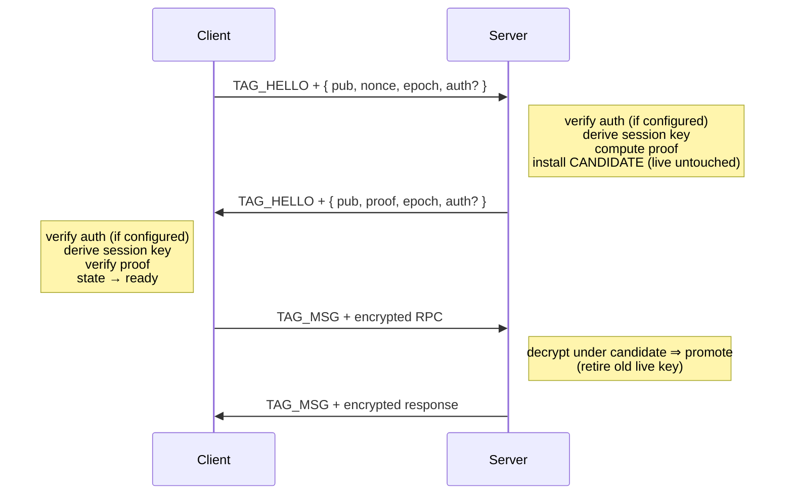

# Protocol

Language-agnostic specification of the Safe RPC wire protocol. Read this to port Safe RPC, audit it, or build a compatible implementation. Everything below is normative.

The reference implementation is in TypeScript, but this document is the contract — the code follows it.

## Goals and non-goals

Design constraints, in order:

1. **Encrypted by default.** No "plaintext mode."
2. **Lazy.** No work happens until the application makes a call. `client()` and `server()` return synchronously.
3. **Resilient.** Either side can fail and re-handshake without coordination from the application.
4. **Transport-agnostic.** The protocol must work over any byte-pipe: duplex socket, message pair, broadcast bus.
5. **No long-lived state in the protocol.** Secret rotation, key revocation: application concerns. The one exception is the optional bounded seen-nonce set (see Replay protection) — per-session, bounded, and dropped with the session.

Non-goals: streaming RPCs in-protocol, multiplexing over a single channel, formal session tickets, ordering guarantees stronger than what the transport provides.

## Primitives

| Primitive            | Algorithm                   | Notes                                               |
| -------------------- | --------------------------- | --------------------------------------------------- |
| Key exchange         | X25519                      | 32-byte keys                                        |
| Symmetric encryption | XSalsa20-Poly1305 (AEAD)    | 24-byte nonce, 32-byte key, 16-byte tag             |
| Hash                 | SHA-256                     | —                                                   |
| Key derivation       | HKDF-Extract+Expand-SHA-256 | RFC 5869                                            |
| MAC                  | HMAC-SHA-256                | RFC 2104                                            |
| Serialization        | msgpack                     | All extension types **disabled** (see Sanitization) |

All wire numbers are network-byte-order (big-endian) unless explicitly noted.

### msgpack profile

Every msgpack document in this protocol (hello/reply maps, RPC envelopes, auth payload profiles) follows one encoding profile. A port that deviates produces frames the reference implementation silently drops or rejects as type-mismatched — the reference decoder strict-checks native types, it does not coerce.

- **Map keys** are msgpack `str`. Field values follow the schema annotations: `bin` fields **must** use the msgpack `bin` family and `string` fields the `str` family — the two are never interchangeable (a `pub`/`nonce`/`sig`/`th` sent as `str`, or an `id`/`p` sent as `bin`, fails the receiver's type guard).
- **Integers** are encoded in the smallest msgpack integer type that holds them: a value in `0..2³²−1` uses `fixint`/`uint8`/`uint16`/`uint32` — never `int64`/`uint64` (`0xd3`/`0xcf`). Integer values outside the 32-bit range are encoded as IEEE-754 `float64` (`0xcb`), not as 64-bit integers. In particular, the JWT profile's `ts` (a millisecond timestamp ≈ 1.8×10¹²) travels as `float64`.
- Rationale a porter must reproduce: the reference codec maps only the 64-bit integer types to a big-integer (`BigInt`); every narrower integer decodes to a native number. Receivers then strict-check native numbers — `t !== 1`, `v !== 1`, `typeof epoch !== "number"`, `typeof ts !== "number"` — so a foreign encoder that writes `t: 1` as `uint64` is decoded to a big-integer and the frame is silently dropped; a `ts` sent as `uint64` is rejected as `"Invalid timestamp"`.

## Constant reference

| Name                     | Value                                               | Purpose                                                                        |
| ------------------------ | --------------------------------------------------- | ------------------------------------------------------------------------------ |
| `NONCE_LEN`              | 24                                                  | XSalsa20-Poly1305 nonce length (per encrypted message)                         |
| `KEY_LEN`                | 32                                                  | Symmetric session key length, X25519 key length, **client hello nonce length** |
| `TAG_HELLO`              | `0x00`                                              | First byte of a handshake frame                                                |
| `TAG_MSG`                | `0x01`                                              | First byte of an encrypted RPC frame                                           |
| `MAX_HELLO_BYTES`        | 65,536                                              | Max size of a handshake frame, **tag byte included**                           |
| `MAX_AUTH_BYTES`         | 32,768                                              | Max size of the optional `auth` payload                                        |
| `MAX_MSG_BYTES`          | 1,048,576                                           | Max size of an encrypted RPC frame (configurable)                              |
| `HANDSHAKE_TIMEOUT_MS`   | 5,000                                               | Default timeout for completing the handshake                                   |
| `RPC_TIMEOUT_MS`         | 30,000                                              | Default per-call timeout (client side)                                         |
| `SEND_TIMEOUT_MS`        | 3,000                                               | Default outbound-queue deadline for an unsent frame (client side)              |
| `MAX_PENDING`            | 256                                                 | Default maximum in-flight RPCs per client                                      |
| `MAX_ID_LEN`             | 64                                                  | Max request `id` length accepted by the server                                 |
| `PROOF_LEN`              | 32                                                  | Length of the HMAC proof in the reply                                          |
| `REPLAY_WINDOW`          | 4,096                                               | Default seen-nonce set capacity (see Replay protection)                        |
| `KDF_INFO`               | UTF-8 bytes of `"saferpc-v1"`                       | HKDF info parameter for session key                                            |
| `PSK_DERIVE_INFO`        | UTF-8 bytes of `"saferpc-session-v1"`               | HKDF info for `deriveSessionSecret` helper                                     |
| `TRANSCRIPT_HELLO_MAGIC` | UTF-8 bytes of `"saferpc-hs-hello-v1\0"` (20 bytes) | Domain separation for client transcript                                        |
| `TRANSCRIPT_REPLY_MAGIC` | UTF-8 bytes of `"saferpc-hs-reply-v1\0"` (20 bytes) | Domain separation for server transcript                                        |
| `EMPTY_SECRET`           | 32 zero bytes                                       | HKDF salt when no secret is configured (asymmetric-only mode)                  |

Two scopes are mixed in this table and a port must distinguish them. **Wire-normative** (both peers must agree or they cannot interoperate): `TAG_*`, `NONCE_LEN`, `KEY_LEN`, `PROOF_LEN`, `MAX_HELLO_BYTES`, `MAX_AUTH_BYTES`, `MAX_ID_LEN`, `KDF_INFO`, `PSK_DERIVE_INFO`, `TRANSCRIPT_*_MAGIC`, `EMPTY_SECRET`. **Local-policy defaults** (each side may configure its own value; they change observable timing/limits but not wire compatibility): `MAX_MSG_BYTES`, `HANDSHAKE_TIMEOUT_MS`, `RPC_TIMEOUT_MS`, `SEND_TIMEOUT_MS`, `MAX_PENDING`, `REPLAY_WINDOW`.

## Frame format

Every wire frame is a single byte tag followed by a payload.

```
frame := tag (1 byte) || payload (...)
```

**Every frame is exactly one transport message.** The protocol is **not** self-delimiting: there is no length prefix, and decryption/decoding consumes the entire delivered buffer as one frame. The core assumes the transport preserves message boundaries (WebSocket, datagram, `MessagePort`, an in-memory pair). Over a stream transport (raw TCP/TLS — the “duplex socket” of goal #4) the channel adapter **must** add its own framing (e.g. a length prefix), reassemble, and hand each complete frame to the core as a single unit; that outer framing is out of protocol scope and not covered by the test vectors.

Two tag values are defined. Implementations **must** drop frames with any other tag.

All frame-size limits in this document are compared against the **full frame length, tag byte included**: a hello frame is dropped when `len(frame) > MAX_HELLO_BYTES`, an RPC frame when `len(frame) > MAX_MSG_BYTES`. (The effective payload maximum is therefore one byte less than the constant.) Ports must use the same comparison or byte-exact conformance tests at the boundary will disagree.

### `TAG_HELLO = 0x00`

The payload is a msgpack-encoded map. The frame is sent in both handshake directions; the map's shape differs by direction.

**Hello (client → server):**

```
{
  pub:   bin   (32 bytes, X25519 public key)
  nonce: bin   (32 bytes, fresh random)
  epoch: uint  (0..2^32-1)
  auth:  bin   (optional, ≤ MAX_AUTH_BYTES)
}
```

**Reply (server → client):**

```
{
  pub:   bin   (32 bytes, X25519 public key)
  proof: bin   (32 bytes, HMAC-SHA-256 over the transcript message, see Proof)
  epoch: uint  (echo of the client's hello.epoch)
  auth:  bin   (optional, ≤ MAX_AUTH_BYTES)
}
```

A frame longer than `MAX_HELLO_BYTES` (tag included) **must** be dropped without state change. A frame that fails msgpack decoding, or decodes to anything other than a map with the required fields, **must** fail the handshake _attempt_ it belongs to (and call `onError` if observed by the server). On the server an invalid hello **must not** disturb an established session — see Re-handshake.

### `TAG_MSG = 0x01`

The payload is an encrypted RPC message:

```
0x01 || nonce (24 bytes) || ciphertext_with_tag (≥ 16 bytes)
```

The ciphertext is the output of XSalsa20-Poly1305 AEAD with:

- Key: the 32-byte session key (see Key derivation)
- Nonce: the 24 bytes immediately following the tag (fresh random per message)
- Plaintext: msgpack-encoded RPC message (request or response)
- Associated data: none

A frame whose total length exceeds `MAX_MSG_BYTES` **must** be dropped. A frame whose ciphertext fails Poly1305 verification **must** be dropped silently. No error, no state change.

## Handshake

The handshake is one round-trip initiated by the client, and it is **lazy** - nothing goes on the wire until the application makes its first RPC call.


```mermaid
sequenceDiagram
    Client->>Server: TAG_HELLO + { pub, nonce, epoch, auth? }
    Note right of Server: verify auth (if configured)<br/>derive session key<br/>compute proof<br/>install CANDIDATE (live untouched)
    Server->>Client: TAG_HELLO + { pub, proof, epoch, auth? }
    Note left of Client: verify auth (if configured)<br/>derive session key<br/>verify proof<br/>state → ready
    Client->>Server: TAG_MSG + encrypted RPC
    Note right of Server: decrypt under candidate ⇒ promote<br/>(retire old live key)
    Server->>Client: TAG_MSG + encrypted response
```

### Step 1: client builds and sends hello

The client generates:

- A fresh X25519 keypair `(c_priv, c_pub)`.
- A fresh 32-byte random nonce `c_nonce`.
- The next epoch value: start at 1, increment on every handshake attempt. Epochs are unsigned 32-bit; values outside `0..2^32-1` are invalid on the wire and **must** be rejected. The counter does not wrap — an implementation that exhausts it (2³² handshake attempts in one client lifetime) must fail the handshake with a terminal error rather than reuse epoch values. Recreating the client resets the counter safely: epochs only disambiguate attempts within one client instance.

If asymmetric `sign` is configured, the client computes the **hello transcript**:

```
hello_transcript :=
    TRANSCRIPT_HELLO_MAGIC ||
    encode_uint32_be(epoch) ||
    c_pub ||
    c_nonce
```

and signs it. The signature payload is opaque to the protocol; its length must be in `1..MAX_AUTH_BYTES`.

The client then sends:

```
0x00 || msgpack({ pub: c_pub, nonce: c_nonce, epoch: epoch, auth: signed? })
```

### Step 2: server processes hello

The server processes the hello as an **attempt**, on state local to that attempt — a fresh ephemeral pair `(s_priv, s_pub)` generated for this hello. An established session, if any, keeps serving while the attempt runs and is **not** replaced at step 10 — the attempt is installed as a _candidate_ that is promoted only when a frame decrypts under it (step 4, make-before-break). A failure at any step discards the attempt's local state and leaves the established session untouched.

> **Invariant (load-bearing).** `(s_priv, s_pub)` is generated fresh per attempt and is never held at module/connection scope. A duplicate hello therefore derives a _different_ `raw` and a _different_ candidate key than the live session, so replayed traffic can never decrypt under the candidate. Moving this pair to a shared scope would silently turn the duplicate-hello nuisance below into a full session-traffic replay. See [make-before-break](#re-handshake).

1. Verify frame length and tag.
2. Decode msgpack, sanitize, check shape. Validate `epoch` is an integer in `0..2^32-1`.
3. If `verify` is configured: require `auth` (`1..MAX_AUTH_BYTES` bytes), build hello transcript, call `verify(auth, transcript)`. On failure, discard the attempt.
4. Compute ECDH shared secret: `raw = X25519(s_priv, c_pub)`. The implementation **must** reject RFC 7748 §6.1 low-order `c_pub` values (normative, not guidance): either the X25519 primitive rejects them by erroring on an all-zero shared output (as the reference's `@noble/curves` does), or the handshake rejects the listed points explicitly before the ECDH. Accepting them in asymmetric-only mode yields an all-zero `raw` and a fully attacker-predictable session key.
5. Call `secret()` if configured. If fewer than `KEY_LEN` bytes, or equal to `EMPTY_SECRET`, fail. If not configured, use `EMPTY_SECRET`. The **entire** returned byte string — not a 32-byte truncation — becomes the HKDF salt, so both peers must return byte-identical secrets of identical length.
6. Derive session key: `session_key = HKDF(SHA-256, IKM=raw, salt=psk, info=KDF_INFO, L=KEY_LEN)`.
7. Zero `raw`. **Do not zero or mutate the secret bytes** — the application owns that buffer, and callers legitimately return the same buffer on every handshake (`secret: () => sharedSecret`).
8. Compute proof: `proof = HMAC-SHA-256(session_key, s_pub || c_pub || c_nonce)`.
9. If `sign` is configured, build **reply transcript** and sign it:

```
reply_transcript :=
    TRANSCRIPT_REPLY_MAGIC ||
    encode_uint32_be(epoch) ||
    c_pub ||
    c_nonce ||
    s_pub
```

10. **Install the candidate atomically**: install `session_key`/decryptor and the verified auth data into the _candidate_ slot, replacing any prior unconfirmed candidate (latest attempt wins). **Do not touch the live session** — its key keeps serving. The candidate is decrypt-only; its encryptor is created on promotion, never before, since the server never encrypts under an unconfirmed key. This install must be a single synchronous block guarded by the attempt's epoch, so a concurrent newer hello cannot interleave. Arm a confirmation timer for the candidate — for the **remaining** handshake budget (`handshakeTimeout` minus the time already spent validating this attempt), not a fresh full-length timer: the total hello→first-confirming-frame window for one attempt is bounded by a single `handshakeTimeout`.
11. Send:

```
0x00 || msgpack({ pub: s_pub, proof: proof, epoch: epoch, auth: signed? })
```

If sending the reply **fails** (the transport threw), the candidate just installed can never be confirmed — the implementation **must** drop it immediately (if it is still the current candidate: guard on the candidate counter), disarming its confirmation timer, rather than leaving it to expire and report a second, spurious timeout on top of the send failure. The live session, if any, is untouched. A single handshake-failure error is surfaced, carrying the transport error as its cause.

The live session is **not** replaced yet. Replacement happens on the first `TAG_MSG` whose Poly1305 tag verifies under the candidate key, regardless of whether the decrypted payload is a well-formed RPC request. Producing a valid AEAD frame under the candidate is the implicit proof that the counterparty holds the key material; only then is the old live key retired (step 4). The inner shape is checked afterwards and may be silently dropped without rolling state back.

### Step 3: client processes reply

1. Verify frame length and tag.
2. Decode msgpack, sanitize, check shape.
3. A reply whose `epoch` is not a valid uint32 **fails the handshake attempt** (fail fast, surface the error); a valid `epoch` that does not equal `this_epoch` is dropped **silently** (stale reply — keep waiting for the current attempt's reply until the handshake timeout).
4. If `verify` is configured: require `auth`, build reply transcript, call `verify(auth, transcript)`. On failure, reset handshake state.
5. Compute ECDH shared secret: `raw = X25519(c_priv, s_pub)`. The same low-order rejection as server step 4 applies to `s_pub` — the client **must** reject RFC 7748 §6.1 low-order server public keys (failing the handshake), for the same reason.
6. Call `secret()` if configured; otherwise use `EMPTY_SECRET`. Validate ≥ `KEY_LEN` bytes; reject a value equal to `EMPTY_SECRET`. As on the server, the entire byte string is the HKDF salt.
7. Derive `session_key` with the same HKDF call as the server.
8. Recompute expected proof: `expected = HMAC-SHA-256(session_key, s_pub || c_pub || c_nonce)`.
9. Compare `expected` to `proof` in **constant time**. Mismatch ⇒ fail.
10. Set encryptor/decryptor, zero intermediate buffers, transition to `ready`.

### Step 4: first encrypted message

The client encrypts and sends its first RPC request. On the server, inbound `TAG_MSG` frames are trial-decrypted **live key first, then candidate key**. Successful AEAD verification under the candidate (Poly1305 tag passes) is the implicit proof that the client knows the secret; the server then **promotes** the candidate — retires the old live key, installs the candidate as the new live session (create its encryptor), advances the response-guard epoch, and clears the replay window. A bootstrap (no prior live session) is the same path with an empty live slot. The inner RPC payload is validated separately. A junk payload that nonetheless decrypts cleanly still confirms and promotes the session; it is just dropped without producing a response.

The response-guard epoch is captured **after** promotion, so the reply to this first confirming frame is not dropped by the guard — the confirming frame is the promoter, not an in-flight leftover from the retired session.

### Re-handshake

A server in **any** state that receives a `TAG_HELLO` opens a new handshake _attempt_ and processes it — this is how transparent recovery works: a client whose session died sends a fresh hello and gets a fresh session without application-layer coordination.

The established session, if one exists, **must survive until a frame decrypts under the new candidate** — i.e. until the counterparty proves it holds the new key material. A validated attempt installs a candidate (step 10); the live key is retired only at promotion (step 4). An invalid hello — malformed, oversized auth, failed `verify`, bad secret — discards only the attempt and never reaches candidate install.

**Underlying rule (normative).** A transition that _destroys_ authenticated state must be authenticated at least as strongly as the state it destroys. A hello proves at most the sender's chosen identity; it may _create_ a candidate. Retiring a live session is _destruction_ and must be gated on proof of key possession — a frame that decrypts under the candidate. (This is the same failure family as forged TCP resets and Wi-Fi deauth: an unauthenticated message tearing down an authenticated connection.)

This make-before-break ordering is load-bearing and closes the displacement hole in **both** modes: neither a byte-for-byte replayed hello nor a well-formed forged hello (secret-only mode) can retire a live session, because neither can produce a frame that decrypts under the fresh-per-attempt candidate key. A duplicate/forged hello can at most create a candidate that expires unconfirmed on its timer.

Residual (accepted, out of threat model): because the latest hello wins the candidate slot, a _flood_ of hellos can keep overwriting the candidate and starve a legitimate peer's reconnect before its confirming frame lands. This is a denial-of-service concern, explicitly outside saferpc's threat model; rate-limit hellos at the transport layer if it matters for your deployment. A cheap partial mitigation (drop byte-identical duplicate hellos via a small recent-transcript-hash cache before signature verification) is possible but not mandated.

Each incoming hello **must** invalidate any prior in-flight attempt (bump the attempt counter/epoch before any `await`-equivalent suspension), so stale suspended attempts detect the change and abandon all writes. A separate counter guards the candidate confirmation timer, bumped only when a candidate is installed — so a later hello that bumps the attempt counter but then fails validation cannot disarm an existing candidate's timeout.

## Key derivation

```
session_key = HKDF(
  hash  = SHA-256,
  ikm   = X25519(local_priv, remote_pub),
  salt  = secret_or_EMPTY_SECRET,
  info  = KDF_INFO,                // "saferpc-v1"
  L     = KEY_LEN,                 // 32
)
```

The secret is the **salt** parameter, not the IKM. This is deliberate: the salt parameter is what HKDF uses for domain separation and authentication.

If both endpoints derive the same `secret` and the X25519 exchange is intact, both arrive at the same `session_key`. An attacker who runs the X25519 exchange but lacks the secret derives a different key and the HMAC proof fails.

When `secret` is not configured (asymmetric-only mode), `secret_or_EMPTY_SECRET` is 32 zero bytes. RFC 5869 allows an all-zero salt; in this mode session authentication relies entirely on the `sign`/`verify` callbacks. The reference implementation refuses an application-supplied `secret()` that returns 32 zeros, so a misconfigured secret never silently degrades into the asymmetric-only mode.

### `deriveSessionSecret` (helper)

Optional convenience for binding the secret to a per-session identifier:

```
deriveSessionSecret(sessionId, secret) := HKDF(
  hash = SHA-256,
  ikm  = secret,                  // ≥ 32 bytes
  salt = utf8(sessionId),         // non-empty
  info = PSK_DERIVE_INFO,         // "saferpc-session-v1"
  L    = KEY_LEN,                 // 32
)
```

The protocol does not require its use.

## Proof

```
proof = HMAC-SHA-256(
  key  = session_key,
  data = s_pub || c_pub || c_nonce,
)
```

The proof binds the session key to the specific ephemeral keys and nonce of this handshake. It is sent by the server in the reply and verified by the client in constant time.

The proof does **not** include the epoch directly. Replay across epochs is prevented because fresh ephemeral keys produce a different `raw`, a different `session_key`, and therefore a different proof.

## Encryption

Per-message encryption:

```
nonce       = random_bytes(24)
plaintext   = msgpack_encode(message)
ciphertext  = XSalsa20-Poly1305-encrypt(session_key, nonce, plaintext, AD=∅)
frame       = 0x01 || nonce || ciphertext
```

Per-message decryption:

```
require frame[0] == 0x01
require len(frame) ≤ MAX_MSG_BYTES
nonce       = frame[1 : 25]
ciphertext  = frame[25 : ]
plaintext   = XSalsa20-Poly1305-decrypt(session_key, nonce, ciphertext, AD=∅)
   on failure: drop silently
message     = sanitize(msgpack_decode(plaintext))
```

The AEAD output layout is NaCl `secretbox`: XSalsa20-Poly1305 with the 16-byte Poly1305 tag **prepended** to the ciphertext, exactly as produced by a `secretbox`-shaped library and matched by the test vector. A port using a raw XSalsa20 + Poly1305 composition must reproduce that layout or ciphertexts will not be byte-compatible.

A 24-byte random nonce gives 192 bits of entropy. Collisions are negligible for any realistic message volume. Safe RPC does **not** use a counter. The trade-off: slightly higher nonce size in exchange for stateless encoding and tolerance for out-of-order or duplicated transport delivery.

> **Directionality.** Both directions encrypt under the **same** session key. With random nonces this is safe for confidentiality (no keystream reuse in practice), but it means a captured frame decrypts on _either_ side. The only thing preventing a reflected client request from being accepted by that same client is the message-type check (`t: 1` vs `t: 2`, below). That check is therefore **mandatory, security-relevant, and must run before any other processing of the decrypted payload**. A port that treats it as optional shape validation loses reflection protection entirely. (A future protocol revision may introduce directional keys; any such change bumps the version strings.)

### Replay protection (seen-nonce set)

Random nonces make accidental collision negligible but do nothing against deliberate replay: an attacker who can inject into a live channel can re-deliver a captured `TAG_MSG` frame and it will decrypt and execute again. The seen-nonce set narrows this window.

The **server** (the side that executes requests) keeps a per-session set of the AEAD nonces it has already accepted, with capacity `REPLAY_WINDOW` (default 4,096; `0` disables the mechanism). Exact semantics — all four rules are load-bearing and a port must implement all of them:

1. **Check before decrypt.** On an inbound `TAG_MSG`, if the 24-byte nonce is in the set, drop the frame silently. (Cheap exact-replay rejection, no AEAD work.)
2. **Insert only after successful Poly1305 verification.** A frame that fails to decrypt must **not** add its nonce to the set. Otherwise an attacker who cannot forge ciphertexts can still flood arbitrary nonces, forcing eviction churn and re-opening the window for entries evicted early.
3. **Bounded, FIFO eviction.** When the set holds `REPLAY_WINDOW` entries, inserting a new nonce evicts the oldest. The honest consequence: a replay older than the last `REPLAY_WINDOW` accepted messages executes again — the window is _narrowed_, not closed. Non-idempotent procedures still want an application-level idempotency key.
4. **Cleared on re-handshake.** A new session key makes old nonces unreplayable (AEAD fails under the new key); keeping them wastes the budget. The set's lifetime is the session key's lifetime.

The client does not need a seen-nonce set for security: response `id`s are matched against the pending-call table and each `id` is used once, so a replayed response is dropped at the RPC layer. A client-side set is permitted but adds nothing.

A transport-duplicated frame (duplication is allowed by the channel contract) is absorbed by rule 1 exactly like an attacker replay: the request executes once, the duplicate is dropped.

## RPC message format

After decryption, an RPC message is a msgpack-encoded map. Two kinds.

### Request (client → server)

```
{
  t:  1,
  id: string,   // non-empty, ≤ MAX_ID_LEN, unique within this client session
  p:  string,   // non-empty procedure name
  i:  any,      // input (validated against procedure's .input schema)
}
```

Nuances a port must reproduce:

- The server **must** drop requests whose `id` is empty or longer than `MAX_ID_LEN` (64), and requests whose `p` is missing, non-string, or empty. Drop means silent drop — no response frame.
- When the caller supplies no input, the `i` key is **omitted entirely**, never encoded as nil. msgpack has no `undefined`; encoding an absent input as nil would make an "optional" input schema on the server observe an explicit null instead of an absent value. An absent key must decode back to the language's absent-value representation.
- The reference client generates `id`s from a monotonically increasing per-client counter. This is not normative — any scheme works — but `id`s **must never be reused** within a client instance: uniqueness is what makes response matching (and the client's replay immunity) sound.

### Response (server → client)

```
// Success
{
  t:  2,
  id: <echo of request id>,
  ok: true,
  d:  any,      // handler output (validated against .output schema)
  e:  null,
}

// Failure
{
  t:  2,
  id: <echo of request id>,
  ok: false,
  d:  null,
  e:  { c: string, m: string, d: any },
}
```

The error map's fields:

| Field | Meaning                                                                                                            |
| ----- | ------------------------------------------------------------------------------------------------------------------ |
| `c`   | Error code. Strings like `"INPUT_VALIDATION"`, `"NOT_FOUND"`, `"UNAUTHORIZED"`, or any application-defined string. |
| `m`   | Human-readable message. Untrusted from the receiver's perspective.                                                 |
| `d`   | Optional structured data, sanitized before transmission.                                                           |

The receiving client must treat every error field as hostile and coerce defensively: if `e` is not a map, surface code `"UNKNOWN"` with an empty message; if `c` is not a non-empty string, use `"UNKNOWN"`; if `m` is not a string, use `""`. Never `String()`-coerce arbitrary values into codes — a stringified `undefined`/object makes a misleading code.

On the server, a handler throwing the implementation's typed RPC error maps to `{ c: code, m: message, d: sanitize(data) }`. Any other thrown value maps to `{ c: "INTERNAL", m: "Internal error", d: null }` — internal error details **must not** leak to the peer. If sanitizing `d` itself fails, the response is not sent at all (the client times out); handler error `data` must be a plain-data tree.

Messages with wrong `t`, missing/empty `id`, missing/empty `p`, or any unexpected type **must** be dropped silently. The protocol has no provision for "bad message" responses. Those would be useful only to an attacker enumerating implementation behavior.

Silent drop applies to malformed **envelopes** only. A **well-formed** request (`t: 1`, valid `id`, non-empty string `p`) whose `p` does not name a procedure in the router is *not* silently dropped: the server returns a normal failure response with code `NOT_FOUND`. At that point the peer has already proven key possession, so the enumeration argument no longer applies.

**Protocol-level error codes.** In addition to application-defined codes, the reference server emits: `INPUT_VALIDATION`, `OUTPUT_VALIDATION`, `MIDDLEWARE`, `NOT_FOUND`, `INVALID_DATA`, `INTERNAL`. A behavior-compatible port **should** emit the same codes for the same conditions. The error `d` payload is implementation-defined (the reference puts its schema library's flattened issues there); clients **must not** depend on its shape.

## State machines

The states, transitions, and their triggers in this section are **normative** — a port must produce the same observable behavior. The internal mechanics referenced alongside them (shared handshake promise, proxy objects, timer bookkeeping) are how the reference implementation realizes the transitions and are informative.

### Server

State is described by two key slots — the **live** session (serves traffic) and
a **candidate** (a validated-but-unconfirmed attempt). `waiting` = neither set,
`pending` = candidate set (live may still be serving), `ready` = live set with
no candidate.

```
[waiting]
   │  TAG_HELLO → attempt validates (steps 1-9) → install candidate
   ▼
[pending] ── 1st TAG_MSG decrypts under candidate → promote ──► [ready]
   │                                                         │
   │ candidate timeout / attempt error                       │  TAG_HELLO → validates
   │ (candidate dropped; live, if any, untouched)            ▼  → install candidate
   ▼                                              [pending] (live still serving)
[waiting or ready]                                     │
(ready if a live session exists)                        │ 1st TAG_MSG under candidate
                                                        ▼  → promote (retire old live)
                                                     [ready] (new session)

Make-before-break: a hello in ANY state opens an attempt on attempt-local
state and, if it validates, installs a CANDIDATE. The live session (if any)
keeps serving and is retired ONLY when a frame decrypts under the candidate
— proof the counterparty holds the key material. A failed / timed-out attempt
or an unconfirmed candidate that expires changes nothing about the live
session. A byte-for-byte replayed or forged hello can therefore at most create
a candidate that expires; it can never displace the live session.

destroy() ⇒ [destroyed], terminal
```

### Client

```
[idle]
   │  api call
   ▼
[handshaking]
   │  reply OK + proof OK
   ▼
[ready]
   │  RPCAbortedError(TIMEOUT) — sent-call reply timeout
   ▼
[idle]  (auto-reset, NO resend; next call re-handshakes)

destroy() ⇒ [closed], terminal
```

The client uses an **epoch counter** to coordinate concurrent failure-and-reset. When multiple calls fail at once, only the first one increments the epoch and resets; the rest see the new epoch and join the in-progress handshake.

## Failure handling (no auto-retry)

Normativity split for porters: the **reset trigger set** (exactly `RPCAbortedError("TIMEOUT")` on a sent call, nothing else), the **no-resend rule**, and the **sent-boundary semantics** (which rejections mean "provably never left" vs "outcome unknown") are normative — they are security decisions, and a port that widens the trigger set re-creates a double-execution hazard. The outbound-queue machinery (the 250 ms retry tick, head-of-line policy, the concrete error-class taxonomy) is reference behavior a port may realize differently as long as the observable semantics hold.

As of 0.7.0 the client does **not** auto-retry. When a sent call times out with `RPCAbortedError("TIMEOUT")` on a `ready` session — **and only then**:

1. If `epoch === sentEpoch` (no other call has already reset), call `reset()`: zero the session key, drop encryptor/decryptor, state ← `idle`. The failed call is **not** resent.
2. The error surfaces to the caller with its typed code. The caller — the only party that knows whether the procedure is idempotent — decides whether to retry.

**Sent boundary.** A call's retry safety is determined by whether its frame reached a live transport. For a synchronous adapter the boundary is `channel.send` returning without throwing. For an asynchronous adapter the boundary is deliberately **conservative**: the frame counts as sent the moment `send` hands back a pending promise — handoff, not resolution. Between handoff and settlement the frame may already be on the wire; classifying a terminal event in that window as "never left" would license a blind resend of a request the server might execute. A false "outcome unknown" merely costs the caller caution; a false "never left" re-creates the double-execution hazard — so the unknown class wins. If the pending promise later **rejects**, the frame provably never left after all: the call rolls back to the unsent class — the frame re-enters the outbound queue if the session is unchanged, or the call fails with a plain `RPCError("CHANNEL")` if a reset staled it in flight. Before the boundary, terminal events (timeout, abort, destroy, `sendTimeout`) reject with a plain `RPCError` — the frame provably never left and the caller may retry freely. After the boundary, terminal events reject with `RPCAbortedError` — outcome unknown. Consequently, while an async send is pending: a global timeout rejects with `RPCAbortedError("TIMEOUT")` and triggers the reset above, an abort rejects with `RPCAbortedError("ABORTED")`, and `sendTimeout` no longer governs the frame — it left the outbound queue at handoff. The boundary placement is normative (it is a security decision); the rollback machinery is reference behavior.

**Core outbound queue.** When `channel.send` throws, the frame enters the core outbound queue. A retry tick (every 250 ms, running only while the queue is non-empty) attempts queued frames in order; the first throw stops the pass (head-of-line: if the channel is down, no later frame bypasses a stuck one). A frame transitions to *sent* the first time `send` succeeds; it then waits for reply-or-timeout only. `sendTimeout` (default 3 000 ms, counted from enqueue) is the per-frame deadline; expiry rejects the call with plain `RPCError("CHANNEL")` — the frame provably never left.

**Why no resend.** A sent-frame `TIMEOUT` does not prove the server did not execute the request, only that no response arrived in time. Resending would silently execute a non-idempotent handler twice. Unsent frames (`RPCError`) are safe to retry; the library defers that choice to the caller in both cases.

**Why still reset (without resending).** A desynced peer — e.g. a restarted server that silently drops `TAG_MSG` over a synchronous transport — would otherwise wedge every future call. Reset keeps healing lazy: the failed call surfaces its error; the _next_ call re-handshakes. The trade-off: `reset()` nulls `decrypt`, so replies to other in-flight sent calls on the same session are dropped and those calls also fail; size `timeout` to the slowest procedure (default 30 s) and shorten individual calls with `AbortSignal.timeout` — an abort never resets.

Calls that received a `RemoteRPCError` (the server responded with `ok: false`) are **not** reset or retried. The server is alive and gave a real answer.

**Transport death is not a session event (0.7.0).** The session is bound to key material, not to a transport instance. When the transport dies the client does nothing: keys are kept, state stays `ready`, pending calls keep waiting under their own timers. A call's outcome is decided by exactly two events — a reply that decrypts, or the call's own timeout. Transport liveness is the adapter's job (reconnect eagerly, hold the transport open, throw from `send` while down); the core retries frames the adapter rejected until `sendTimeout` expires — a definite `RPCError("CHANNEL")` if the transport stays down. A frame written to a live transport has unknown outcome and is never resent by any layer. If the peer lost its session together with the transport, the call hits `RPCAbortedError("TIMEOUT")` and the reset path above heals lazily. Per-call `signal` aborts are client-local and never touch the session — `ABORTED` is outside the reset trigger set.

Local guardrail errors **must not** trigger the reset path either. The `CLIENT` backpressure error (`maxPending` exceeded), id-counter exhaustion, and any other error that does not indicate a dead session leave the session exactly as it was: resetting a healthy session on a guardrail error would tear down the encryption state for every in-flight call, force them into timeout, and re-execute their handlers — double execution with no attacker involved. The reset trigger set is exactly: `RPCAbortedError` with code `TIMEOUT` — a sent call whose reply never arrived. Nothing else.

Concurrent failures share one re-handshake via the epoch counter, so there are no reset storms.


## Sanitization

Every decoded msgpack value passes through a sanitization step, inbound and outbound (the latter on error payloads).

**Language-neutral core (normative for every port):**

1. Recursion depth greater than 32 ⇒ `INVALID_DATA`.
2. Any msgpack extension type, **including the built-in Timestamp (type -1)** ⇒ `INVALID_DATA`. The Timestamp extension is explicitly rejected because msgpack libraries hard-code its decoder.
3. Reject any decoded value whose type is not in the plain-data set: nil, boolean, number/big-integer, string, `bin`, array, string-keyed map. Anything a codec maps to a richer host type (dates, native collections, wrapped ext data) is rejected.

**JS-specific realization (how the reference implements rule 3 and defends a JS-only attack class):**

- Any object whose prototype is neither `Object.prototype` nor `null` is rejected. This catches `Date`, `Map`, `Set`, `ExtData`, and any host object that arrived through an unexpected codec path.
- Object keys equal to `"__proto__"`, `"constructor"`, or `"prototype"` are stripped during traversal (prototype-pollution defense; meaningless in most other languages).
- Plain objects are rebuilt with `Object.create(null)` so prototype chains cannot be re-poisoned downstream.

`Uint8Array` (msgpack `bin`) is preserved. 64-bit wire integers are decoded as big-integers (see [msgpack profile](#msgpack-profile)). A port to a language without prototype pollution implements the language-neutral core and whatever "weird host type" rejection its own codec requires.

## Authorization data flow

When `auth.verify` is configured on the server, the value it returns is the verified principal for the lifetime of the session. Safe RPC takes the returned `{ auth: ... }` object, sanitizes it, and:

- Stores it on the server session.
- Passes it as `{ auth: verified }` to the `context` factory on every request.
- Discards it when the session it belongs to ends: replaced by a successful re-handshake (the new session carries the new attempt's verified auth), pending-session timeout, or destroy.

```
server.verify(hello.auth, hello_transcript)
    → { auth: { userId, ... } }
        │
        ▼
on each request:
    ctx = context({ auth: verified })
        │
        ▼
    procedure runs with ctx
```

If the `context` factory itself throws, the request is answered with a generic `INTERNAL` error response — the thrown detail **must not** leak to the peer.

Clients can also configure `verify`. On the client side the return value is unused. Success is signaled by not throwing.

## Auth payload profiles

The `auth` field carried in a hello or reply frame is **opaque bytes to the core protocol** — the handshake only bounds its length (`1..MAX_AUTH_BYTES`) and hands it to the application's `sign`/`verify` pair. A custom `sign`/`verify` may put anything there; it is not bound by this section.

The shipped auth helpers, however, define a fixed wire schema, and a captured helper payload is de-facto wire format: a port in another language that wants to interoperate with a TypeScript peer using a shipped helper **must** produce and accept the exact msgpack maps below. These schemas are therefore **normative when a shipped helper is used**.

Every helper payload is a msgpack map carrying a profile version `v`. A verifier **must** reject a payload whose `v` is absent or not a version it implements (rather than best-effort decoding a schema it was not written for), with an `UNAUTHORIZED`-class failure. The current version for every profile is `1`. Any change to a profile's field set, field meaning, or signature input **must** bump that profile's `v`.

All three signing profiles bind to the same handshake transcript defined in [Handshake](#handshake): the client-side helper signs (or digests) the **hello** transcript; a server-side signing helper would use the **reply** transcript. Byte layout of the transcript is fixed by that section. The binding *input* differs per profile and is wire-normative: `ed25519` and `ecdsa` sign the **raw transcript bytes**; `jwt` embeds **`SHA-256(transcript)`**. Mixing these up produces payloads the counterparty rejects.

### Profile `jwt` (bearer token, digest-bound) — `v: 1`

```
{
  v:   1,
  jwt: string,        // non-empty; opaque to the protocol, validated by the app
  ts:  uint,          // client clock, milliseconds since Unix epoch
  th:  bin (32 bytes) // SHA-256(transcript)
}
```

On the wire `ts` is a `float64` (see [msgpack profile](#msgpack-profile)) whose value is an integer count of milliseconds; a port's verifier must accept the float and treat it as ms. The reference `maxAge` default is 30 000 ms (server-side policy, configurable, not a wire constant).

The verifier **must**, in order: reject unknown `v`; require `jwt` a non-empty string; require `ts` a finite number and `|now - ts| ≤ maxAge` (symmetric skew — a one-sided `>` check accepts future-dated forgeries); require `th` exactly 32 bytes and equal to `SHA-256(transcript)` compared in **constant time**; only then call the application token validator. A JWT is a bearer credential: the digest binds a captured payload to *this* handshake, but possession of the token is sufficient to mint a fresh payload — the profile does not and cannot change that. See [Security § JWT](security.md#jwt-bearer-token-transcript-bound).

### Profile `ed25519` (device signature) — `v: 1`

```
{
  v:        1,
  deviceId: string,        // non-empty; server looks up the matching public key
  sig:      bin (64 bytes) // Ed25519 signature over the transcript bytes
}
```

The verifier **must**: reject unknown `v`; require `deviceId` a non-empty string; require `sig` exactly 64 bytes; resolve the device's 32-byte Ed25519 public key (rejecting an out-of-band revoked/unknown device before any crypto if a policy hook is configured); verify `sig` over the **raw transcript bytes** (not a pre-hash). The returned principal is `{ deviceId, verified: true }`.

### Profile `ecdsa` (P-256 signature) — `v: 1`

```
{
  v:          1,
  identifier: string,   // non-empty; server looks up the matching public key
  sig:        bin       // ECDSA P-256 signature (IEEE-P1363 r||s), SHA-256 of transcript
}
```

The verifier **must**: reject unknown `v`; require `identifier` a non-empty string; require `sig` non-empty; resolve the P-256 public key; verify the signature over the transcript with SHA-256 as the hash. Signature encoding is WebCrypto's raw `r||s` (IEEE P-1363), **not** DER — a port using a DER-only ECDSA library must transcode. Unlike `ed25519`, `sig` has no length guard: a wrong-length value fails at signature verification, not at a shape check. The returned principal is `{ identifier, verified: true }`.

> Certificate and multi-factor composition are **not** shipped helpers and define no profile: build them from a custom `sign`/`verify`. A multi-factor verifier that composes two of the above must additionally assert both factors resolve to the **same** principal before combining them — the composition itself carries no such guarantee. See [Security § Custom schemes](security.md#custom-schemes-certificates-multiple-factors).

## Failure modes

| Failure                                       | Server response                               | Client response                                           |
| --------------------------------------------- | --------------------------------------------- | --------------------------------------------------------- |
| Empty (zero-length) frame                     | Drop silently                                 | Drop silently                                             |
| Bad frame tag                                 | Drop silently                                 | Drop silently                                             |
| Frame > max size                              | Drop silently                                 | Drop silently                                             |
| msgpack decode error (hello)                  | Discard attempt, `onError`; session survives  | Fail handshake                                            |
| Sanitization failure (hello)                  | Discard attempt, `onError`; session survives  | Fail handshake                                            |
| Bad secret / missing secret bytes             | Discard attempt (`HANDSHAKE`), `onError`      | Fail handshake (`HANDSHAKE`)                              |
| Auth payload `v` absent/unknown (shipped helper) | Discard attempt (`UNAUTHORIZED`), `onError` | Fail handshake                                            |
| Reply send throws (server)                    | Drop candidate, one `HANDSHAKE` error (cause) | —                                                        |
| Sync auth callback overruns `handshakeTimeout` | Install nothing; attempt dies at the deadline | Fail handshake (`HANDSHAKE`)                             |
| `verify` throws                               | Discard attempt, `onError`; session survives  | Fail handshake                                            |
| `sign` returns invalid payload                | Discard attempt                               | Fail handshake                                            |
| Proof mismatch (client)                       | —                                             | Fail handshake                                            |
| Poly1305 mismatch (post-handshake)            | Drop frame silently                           | Drop frame silently                                       |
| Replayed `TAG_MSG` nonce (within window)      | Drop frame silently                           | Optional (see Replay protection)                          |
| Stale reply (`epoch` mismatch)                | —                                             | Drop reply silently                                       |
| Stale request (after session replaced)        | Drop response (epoch guard)                   | Times out; error surfaces, caller decides (no auto-retry) |
| RPC handler throws non-`RPCError`             | Send `{ c: "INTERNAL", m: "Internal error" }` | Surface as `RemoteRPCError`                               |
| Local guardrail (`maxPending`, id exhaustion) | —                                             | Reject that call only; session untouched, **no retry**    |

Silent drops are deliberate. Any feedback at the wire level gives an attacker probing material.

## Compatibility

- The `auth` field on hello and reply is **optional**. Peers that do not understand it ignore it; peers that need it reject frames that lack it. Secret-only deployments stay wire-compatible with mutual-auth deployments as long as neither side has `verify` configured.
- The transcript magic strings (`saferpc-hs-hello-v1`, `saferpc-hs-reply-v1`) and `KDF_INFO` (`saferpc-v1`) are version markers. Any change to transcripts, key derivation inputs, or framing **must** bump these strings. Otherwise an attacker could mix and match versions in a downgrade attack.
- New fields can be added to the request/response messages (`t: 1` and `t: 2` maps). Implementations **must** ignore unknown fields. They **must not** accept messages with wrong `t` or missing required fields.

## Implementation checklist

A new-language port that ticks every item is conformant:

- [ ] Constants match the table above exactly (wire-normative set byte-exact; local-policy defaults may differ by configuration).
- [ ] The msgpack profile is reproduced: smallest-width integers (never `int64`/`uint64` for values ≤ 2³²−1; `float64` beyond), `bin`/`str` families never interchanged, `str` map keys. See [msgpack profile](#msgpack-profile).
- [ ] Frames are delivered as whole transport messages; over stream transports the adapter adds its own framing (the protocol is not self-delimiting).
- [ ] X25519, XSalsa20-Poly1305, HKDF-SHA-256, HMAC-SHA-256 implementations are constant-time where the spec requires (proof comparison, MAC verification).
- [ ] The X25519 implementation rejects RFC 7748 §6.1 low-order public keys (or the application layer rejects them before `getSharedSecret`). Accepting them in asymmetric-only mode lets an active MITM force a deterministic all-zero ECDH output and decrypt the session. See [Security § Ephemeral key validity](security.md#ephemeral-key-validity).
- [ ] msgpack codec rejects all extension types; built-in Timestamp explicitly.
- [ ] Sanitization rejects host objects (or the language equivalent of "weird types"), strips prototype-pollution keys, limits depth.
- [ ] Handler output is also sanitized (or otherwise restricted to plain-data trees) before encoding, so a stray host object surfaces as `INVALID_DATA` and not an opaque `INTERNAL`.
- [ ] Frames are bounded by `MAX_HELLO_BYTES` / `MAX_MSG_BYTES`.
- [ ] Hello transcript and reply transcript are built from the exact byte sequences shown.
- [ ] Auth is processed **before** any session key is materialized; failed auth never leaks session state.
- [ ] The server's ephemeral pair `(s_priv, s_pub)` is generated **fresh per hello attempt** and never held at module/connection scope. This is load-bearing for make-before-break: it guarantees a duplicate hello derives a different candidate key than the live session, so replayed traffic can never decrypt under the candidate and force a promotion.
- [ ] A validated attempt is installed as a **candidate**, not swapped into the live session. The live key is retired only when a `TAG_MSG` decrypts under the candidate key (make-before-break). Inbound frames are trial-decrypted live-first, then candidate.
- [ ] The response-guard epoch is captured **after** promotion (not at frame arrival), so the reply to the confirming frame is not dropped by the guard.
- [ ] Client epoch increments per handshake attempt (and per session reset) and is echoed verbatim in the reply; it is validated as a uint32 on the wire and never wraps (exhaustion is a terminal client error). The server does NOT bump a single mirror counter — under make-before-break it keeps three internal counters: `attemptEpoch` (per incoming hello; invalidates older attempt coroutines), `candidateEpoch` (per candidate install; guards the confirmation timer), and `epoch` (per promotion; guards TAG_MSG responses).
- [ ] The attempt counter is bumped for **every** incoming hello, including ones that arrive while a previous attempt is still suspended at an `await`. In-flight stale attempts detect themselves via the guard and abandon all writes.
- [ ] Every `await` in the handshake path is followed by an attempt + destroyed guard before any session state is written. The candidate install happens under a final guard inside a single synchronous block.
- [ ] The handshake budget is enforced by an **absolute wall-clock deadline**, checked after every suspension point, not only by a timer/flag. A synchronous auth callback (`sign`/`verify`/`secret`) that blocks the event loop past the budget resumes before a timer macrotask can fire; a flag-only guard is still unset at that point and would install a candidate + send a reply after expiry. The deadline check (both sides) rejects that.
- [ ] A reply-send failure on the server drops the just-installed candidate (guarded on the candidate counter) and reports a single handshake error; it does not leave the candidate to expire into a second timeout.
- [ ] Inbound `TAG_MSG` promotion is gated on **AEAD verification only**. Decoding/sanitizing the inner payload happens *after* promotion and after the nonce is recorded in the replay set; a malformed inner payload under a proven key still promotes and still consumes its nonce (it is only dropped from producing a response). Conflating decode failure with Poly1305 failure would strand the candidate.
- [ ] Numeric limits (`maxPending`, `maxMessageBytes`, JWT `maxAge`) are validated at construction: a non-finite or non-positive value is rejected with an error, never accepted (a `NaN` bound silently disables the check, since `x > NaN` is always false).
- [ ] Shipped auth helpers stamp a profile version `v` and verifiers reject an absent/unknown `v` (see [Auth payload profiles](#auth-payload-profiles)); the three profile schemas are reproduced byte-for-byte.
- [ ] A separate counter guards the candidate confirmation timer, bumped only when a candidate is installed — so a later hello that bumps the attempt counter but then fails validation cannot disarm an existing candidate's timeout.
- [ ] Hello processing runs on **attempt-local** state; an established session keeps serving during the attempt and is retired only on promotion. An invalid hello (malformed, oversized, failed `verify`, bad secret), a byte-for-byte replayed hello, or a well-formed forged hello never disturbs an established session — at most it creates a candidate that expires unconfirmed.
- [ ] Secret bytes equal to `EMPTY_SECRET` (32 zero bytes) are rejected at runtime when `auth.secret` is configured.
- [ ] The X25519 raw shared secret is zeroed in a try/finally so a thrown `psk()` does not leak it.
- [ ] Ephemeral private keys captured for the duration of an `await` are owned by the in-flight attempt (copied, not aliased), so a concurrent reset that zeroes the live buffer does not corrupt the in-flight derivation.
- [ ] Server accepts new hellos in any state (including `ready`).
- [ ] Client does **not** auto-retry. On a sent-call reply timeout (`RPCAbortedError("TIMEOUT")`) while `ready` it resets the session (zeros the key, state → `idle`) **without resending**, then surfaces the error; the caller decides whether to retry. It never resets on `RemoteRPCError`, guardrail errors (`maxPending`, counter exhaustion), or unsent-frame failures — those reject the call and leave the session intact.
- [ ] The application's secret buffer is never mutated or zeroed by the protocol; only protocol-owned copies and derived material are zeroed.
- [ ] Request `id` is validated: non-empty string, ≤ `MAX_ID_LEN`; `p` non-empty string; violations are silent drops. A well-formed request naming an unknown procedure gets a `NOT_FOUND` error response, not a silent drop.
- [ ] The candidate confirmation timer is armed with the **remaining** handshake budget, so one attempt's hello→confirmation window never exceeds a single `handshakeTimeout`.
- [ ] Absent call input omits the `i` key entirely (never nil).
- [ ] The `t` type check on decrypted messages runs before any other processing — it is the reflection defense for the shared bidirectional key, not cosmetic validation.
- [ ] Remote error fields are coerced defensively (`c` non-empty string else `UNKNOWN`, `m` string else empty); non-`RPCError` handler throws map to `INTERNAL` with no detail leakage.
- [ ] Seen-nonce set (when enabled): membership check before decrypt, insert only after AEAD verification, FIFO eviction at capacity, cleared on re-handshake.
- [ ] Ephemeral keys, raw shared secrets, and session keys are zeroed on reset and destroy.
- [ ] The proof is verified in constant time.
- [ ] No information is sent back to a peer that sends a malformed frame.

When every item holds and the test vectors below pass, two implementations interoperate.

## Test vectors

Known-answer vectors generated from the reference implementation (pinned by `test/unit/vectors.test.ts`; regenerate with `node scripts/gen-vectors.mjs`). A port that reproduces every value below byte-for-byte derives wire-compatible sessions. All values are lowercase hex.

### Inputs

```
c_priv  = 0102030405060708090a0b0c0d0e0f101112131415161718191a1b1c1d1e1f20
s_priv  = 4142434445464748494a4b4c4d4e4f505152535455565758595a5b5c5d5e5f60
c_nonce = 8182838485868788898a8b8c8d8e8f909192939495969798999a9b9c9d9e9fa0
secret  = c1c2c3c4c5c6c7c8c9cacbcccdcecfd0d1d2d3d4d5d6d7d8d9dadbdcdddedfe0
epoch   = 1
```

### Derived values

```
c_pub       = X25519_pub(c_priv)
            = 07a37cbc142093c8b755dc1b10e86cb426374ad16aa853ed0bdfc0b2b86d1c7c
s_pub       = X25519_pub(s_priv)
            = 64b101b1d0be5a8704bd078f9895001fc03e8e9f9522f188dd128d9846d48466
raw_shared  = X25519(c_priv, s_pub) = X25519(s_priv, c_pub)
            = 26c2c17fdb82161cb21ad16e721315355b64d1763119b10bfc962530dc7cc163

session_key = HKDF(SHA-256, ikm=raw_shared, salt=secret, info="saferpc-v1", L=32)
            = 26cfff1fd363520e6adc49c5f0647197d6bf84063ba7d977be53abe5a09e4df1

# asymmetric-only mode: same inputs, salt = EMPTY_SECRET (32 zero bytes)
session_key_empty_secret
            = 09f21f20ea6205029a057330916649c6d92ca421067b2249358a4f7d8d79ba68

proof       = HMAC-SHA-256(session_key, s_pub || c_pub || c_nonce)
            = 1d55f7b3d9eda8cb8a30a269197139afe10fd4557f426698513de175a41cd0b3
```

### Transcripts (epoch = 1)

```
hello_transcript = "saferpc-hs-hello-v1\0" || be32(1) || c_pub || c_nonce
= 736166657270632d68732d68656c6c6f2d763100 00000001
  07a37cbc142093c8b755dc1b10e86cb426374ad16aa853ed0bdfc0b2b86d1c7c
  8182838485868788898a8b8c8d8e8f909192939495969798999a9b9c9d9e9fa0

reply_transcript = "saferpc-hs-reply-v1\0" || be32(1) || c_pub || c_nonce || s_pub
= 736166657270632d68732d7265706c792d763100 00000001
  07a37cbc142093c8b755dc1b10e86cb426374ad16aa853ed0bdfc0b2b86d1c7c
  8182838485868788898a8b8c8d8e8f909192939495969798999a9b9c9d9e9fa0
  64b101b1d0be5a8704bd078f9895001fc03e8e9f9522f188dd128d9846d48466
```

(Line breaks are for readability; the transcript is one contiguous byte string.)

### `deriveSessionSecret` helper

```
deriveSessionSecret("session-abc123", secret)
= HKDF(SHA-256, ikm=secret, salt=utf8("session-abc123"), info="saferpc-session-v1", L=32)
= e90487157dafebc492bf80cb1b0dc9818b220ee2fbbce3304ed4fc0a181e02db
```

### Encrypted frame

Request `{ t: 1, id: "1", p: "ping" }` under `session_key` (the PSK-mode key above) with a fixed message nonce:

```
msg_nonce = 1112131415161718191a1b1c1d1e1f202122232425262728
plaintext = msgpack({t:1, id:"1", p:"ping"})
          = 83a17401a26964a131a170a470696e67
frame     = 0x01 || msg_nonce || XSalsa20-Poly1305(session_key, msg_nonce, plaintext)
          = 011112131415161718191a1b1c1d1e1f202122232425262728
            d6305197fd685b58024ba4e38d269a78d4afe8373d476fe52d04f1d3ed9aa51e
```

A port must decrypt this frame to the plaintext above, and its own encryption of the same plaintext under the same key and nonce must produce the identical frame. (In real operation the nonce is random per message — the fixed nonce exists only for this vector.)

Two caveats for the frame vector. msgpack map-key order follows encoding order — the vector encodes keys as `t`, `id`, `p`; match that order when reproducing the exact bytes (the protocol itself does not require canonical key order, only this vector does). And byte-equality of ciphertext requires the same AEAD construction: XSalsa20-Poly1305 as in NaCl `secretbox`, no associated data.

### Auth profile payloads

Known-answer payloads for the three shipped profiles (see [Auth payload profiles](#auth-payload-profiles)), all bound to `hello_transcript` above. Key order in each map follows the field order shown in the profile schemas (`v` first). Pinned by `test/unit/vectors.test.ts`.

**Profile `jwt`** — fully deterministic. Note `ts` on the wire is a `float64` (`0xcb`), per the [msgpack profile](#msgpack-profile).

```
jwt     = "test.jwt.token"
ts      = 1700000000000
th      = SHA-256(hello_transcript)
        = c76c6aaff8ac6c00e1168ffdafc87255a79eef052a4a7b39c542506a81010c9e
payload = msgpack({v:1, jwt, ts, th})
        = 84a17601a36a7774ae746573742e6a77742e746f6b656ea27473cb4278bcfe56800000
          a27468c420c76c6aaff8ac6c00e1168ffdafc87255a79eef052a4a7b39c542506a81010c9e
```

**Profile `ed25519`** — fully deterministic (RFC 8032 signatures are deterministic); a conformant port reproduces the payload byte-for-byte.

```
seed     = 6162636465666768696a6b6c6d6e6f707172737475767778797a7b7c7d7e7f80
pub      = 882d0ea3b2864e7a587f3e698cea4459998312e655e05fa5e8b5119d8baac8cd
deviceId = "device-1"
sig      = Ed25519(seed, hello_transcript)
         = c056e0893556d73576ab05fa9ef2314d16686f326905c3e1e1f0b2b10eb003f5
           1a6a41aa2d1e14f737fdfeede47d7ecec84380d7e70733cd3579653db72c7105
payload  = msgpack({v:1, deviceId, sig})
         = 83a17601a86465766963654964a86465766963652d31a3736967c440
           c056e0893556d73576ab05fa9ef2314d16686f326905c3e1e1f0b2b10eb003f5
           1a6a41aa2d1e14f737fdfeede47d7ecec84380d7e70733cd3579653db72c7105
```

**Profile `ecdsa`** — ECDSA is randomized in most signers (including WebCrypto), so this vector's signature is the **RFC 6979 deterministic** lowS signature (SHA-256 prehash, P-1363 `r||s`). A port with a randomized signer will not reproduce these bytes — and does not have to. The two-sided conformance check: (a) this payload **must verify** in the port's verifier against the public key below; (b) a payload produced by the port's signer **must verify** against the same public key, and its envelope (everything except the `sig` value) must be byte-identical to this vector's structure.

```
priv       = a1a2a3a4a5a6a7a8a9aaabacadaeafb0b1b2b3b4b5b6b7b8b9babbbcbdbebfc0
pub        = 04ad137f7ef829eef8a8571bf4d307664ea8e024e05bda4e26da8f7ae8844560
             58a88e48c9a1d9386471f13f2559758edc4bc1e11394eb415d63e2d33e4d38519d
identifier = "entity-1"
sig        = ECDSA-P256-RFC6979-lowS(priv, SHA-256(hello_transcript))
           = 383ae1bc960796f9ae710ffa7dc73cc8bdb7522567e0f5b2180f4a74cac0f68a
             00bea85c160d745e881050a72bdb9fbb4a03a2aba4c65dcf29c29dc319796b01
payload    = msgpack({v:1, identifier, sig})
           = 83a17601aa6964656e746966696572a8656e746974792d31a3736967c440
             383ae1bc960796f9ae710ffa7dc73cc8bdb7522567e0f5b2180f4a74cac0f68a
             00bea85c160d745e881050a72bdb9fbb4a03a2aba4c65dcf29c29dc319796b01
```

(Hex line breaks are for readability; each value is one contiguous byte string.)
