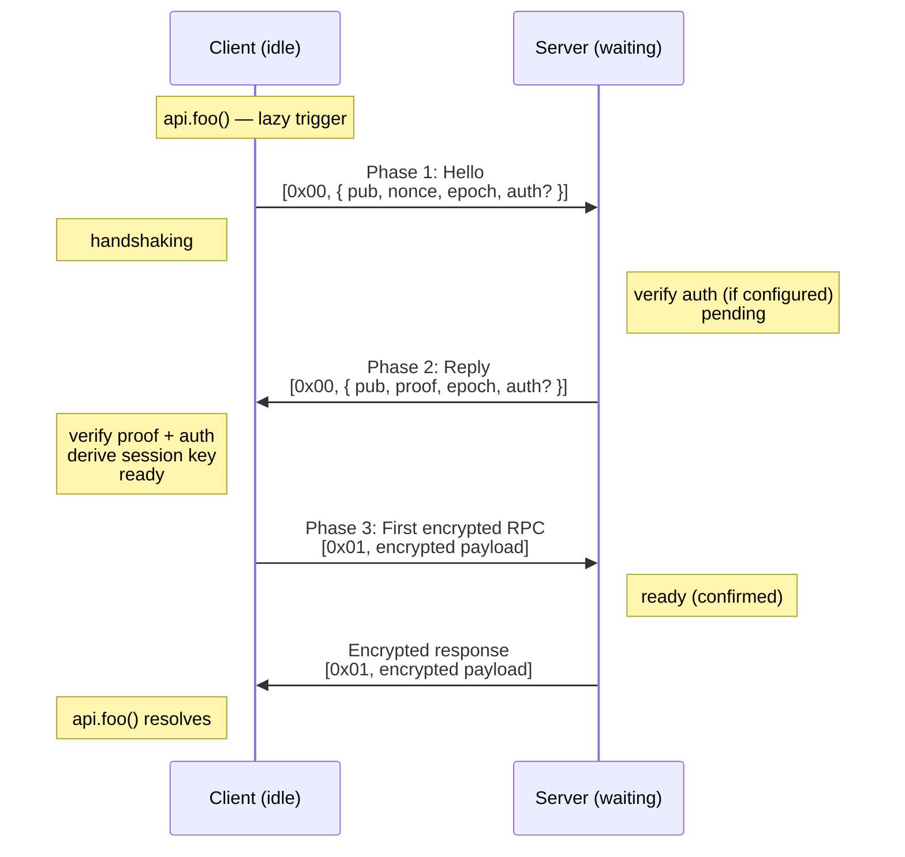

# Security

eRPC treats the transport as hostile. Everything below describes what that means, what eRPC actually guarantees, and how to configure auth so those guarantees hold.

## Threat model

The transport channel is **untrusted**. The attacker may:

- Read all messages (eavesdrop)
- Inject messages (forge)
- Replay captured messages
- Drop or reorder messages

eRPC does **not** protect against denial of service. If the attacker drops every byte, communication is impossible. There is no fix for that at this layer.

eRPC also does not protect against a compromised endpoint. If the attacker runs code on either side, encryption is irrelevant.

## Security properties

| Property | Mechanism |
|----------|-----------|
| Confidentiality | XSalsa20-Poly1305 AEAD per message |
| Authentication (session) | PSK mixed into HKDF + optional asymmetric signatures |
| Server identity | HMAC proof in handshake reply (+ optional signature) |
| Client identity | Implicit (wrong PSK ⇒ invalid ciphertext) + optional signature |
| Forward secrecy | Fresh ephemeral X25519 keys per session |
| Replay across handshakes | Random nonce + epoch counter + transcript-bound signatures |
| Replay across peers | Domain-separated transcript prefixes |
| Replay within a session | Random 24-byte nonces per message (probabilistic) |
| Stale responses | Epoch counter echoed in reply |
| Prototype pollution | `sanitize()` strips `__proto__`, `constructor`, `prototype` |
| Type confusion | msgpack extension types disabled (including Timestamp) |
| Memory hygiene | Ephemeral keys zeroed on reset/destroy |

## Authentication modes

Three modes. At least one of `psk` or asymmetric auth (`sign` / `verify`) must be configured. Neither configured is a hard error — the handshake would be unauthenticated and an active MITM could impersonate either peer.

### PSK only

```typescript
auth: { psk: () => sharedSecret }

auth: {
  psk: () => deriveSessionPSK(sessionToken, deviceSecret),
}
```

Use when both endpoints are controlled by the same entity, secrets can be rotated, and individual revocation is not required. PSK is cheap — no signature operations on the hot path.

### Asymmetric only

Client signs, server verifies. Or both sign and both verify (mutual auth).

```typescript
// Client
auth: { sign: async (transcript) => signWithDeviceKey(transcript) }

// Server
auth: {
  verify: async (proof, transcript) => {
    const principal = await verifyDeviceSignature(proof, transcript);
    return { auth: principal };
  },
}
```

Use when one side is a public client (browser, mobile app, IoT device), when there are no shared secrets to safely distribute, or when you need per-device identity and revocation.

### Both (defense-in-depth)

```typescript
auth: {
  psk: () => deriveSessionPSK(sessionId, deploymentSecret),
  sign: (transcript) => signWithDeviceKey(transcript),
  verify: (proof, transcript) => verifyDeviceSignature(proof, transcript),
}
```

Use when you want session binding *and* identity proof. An attacker must now compromise two independent things — the derivation secret and the device key — and still cannot read past sessions because of forward secrecy.

### PSK vs asymmetric comparison

| Property | Session-derived PSK | Asymmetric |
|----------|-------------------|------------|
| Identity granularity | Per session | Per key/device |
| Revocation | Rotate root secret (affects all) | Revoke individual keys |
| Compromise blast radius | All sessions sharing the root | The compromised device only |
| Forward secrecy | Ephemeral ECDH | Ephemeral ECDH |
| Replay protection | Epoch + nonce + key binding | Transcript bound |
| Cost | Low (HMAC only) | Higher (signature ops) |
| Complexity | Simple | More moving parts |

Forward secrecy comes from the ephemeral X25519 exchange in both modes. Even if a long-term secret leaks, past session ciphertexts remain unreadable — the ephemeral private keys were zeroed when the session ended.

## Handshake

Lazy. The client starts the handshake on the first RPC call, not at construction. Three phases.



1. **Hello.** Client sends ephemeral public key, a fresh 32-byte nonce, an epoch counter, and (if signing) a signature over the hello transcript.
2. **Reply.** Server verifies any client auth, runs ECDH, derives the session key with the PSK as HKDF salt, and sends back its public key plus an HMAC proof and (if signing) a signature over the reply transcript.
3. **First RPC.** Client verifies the reply, derives the same session key, and sends its first encrypted call. The server transitions to `ready` only when this first message decrypts cleanly — successful decryption is the client's implicit proof.

The server can accept a new hello even in `ready` state. That is the re-handshake path: when a client times out and resets, it sends a fresh hello, the server resets its session state, and a new key is negotiated transparently.

### Auth processing order

Auth runs **before** any session keys are materialized. Failed verification never leaks ECDH artifacts.

**Server (on hello):**

1. Parse the hello frame.
2. If `verify` is configured: extract `auth` payload, build hello transcript, call `verify(payload, transcript)`. Store returned `auth` data for the session.
3. Compute X25519 shared secret.
4. Call `psk()` (or use empty PSK) and derive session key.
5. If `sign` is configured: sign reply transcript and embed result.
6. Send reply with HMAC proof.

**Client (on reply):**

1. Parse the reply frame.
2. If `verify` is configured: extract `auth`, build reply transcript, call `verify(payload, transcript)`.
3. Compute shared secret, derive session key.
4. Verify HMAC proof in constant time.
5. Transition to `ready`.

A throw at any step rejects the handshake. The client resets to `idle`; the server resets to `waiting`. Failed verifications never silently downgrade.

### Transcript format

Signatures sign over canonical transcripts built by eRPC, not user data. Two domains:

```
HELLO transcript:
  "erpc-hs-hello-v1\0"   (17 bytes, magic prefix)
  epoch                  (4 bytes, big-endian uint32)
  client_pub             (32 bytes, X25519)
  client_nonce           (32 bytes)

REPLY transcript:
  "erpc-hs-reply-v1\0"   (17 bytes, magic prefix)
  epoch                  (4 bytes, big-endian uint32)
  client_pub             (32 bytes)
  client_nonce           (32 bytes)
  server_pub             (32 bytes)
```

The two prefixes plus the epoch plus the per-handshake nonce defeat:

- Replay across direction (hello vs. reply use different prefixes)
- Replay across handshake attempts (epoch differs each time)
- Substitution attacks (an active MITM cannot swap either ephemeral public key without invalidating the signature)

## State machines

### Server

```
waiting --> pending : hello received + auth verified
pending --> ready   : 1st valid TAG_MSG
pending --> waiting : timeout / error / auth failure
ready   --> waiting : new hello (client re-handshaking)
waiting --> waiting : new hello
```

The server survives failures. Bad PSK, bad signature, timeout — it resets to `waiting` and accepts the next hello. Only an explicit `destroy()` is permanent.

### Client

```
idle        --> handshaking : api call / hello sent
handshaking --> ready       : server reply OK + auth verified
handshaking --> idle        : hs timeout / hs error / auth failure
ready       --> idle        : timeout / send error (auto-reset, epoch check)
```

The client resets on session failure and retries once on the next call. See [API: Auto-Retry](api.md).

## Key management

### Session key derivation

```
session_key = HKDF(
  hash  = SHA-256,
  ikm   = X25519(local_priv, remote_pub),
  salt  = psk_or_EMPTY_PSK,
  info  = KDF_INFO,           // "drpc-v1"
  L     = KEY_LEN,            // 32
)
```

The PSK is the **salt** parameter, not the IKM. This is deliberate: the salt parameter is what HKDF uses for domain separation and authentication. An attacker who runs the X25519 exchange but lacks the PSK derives a different key and the HMAC proof fails.

### Safe PSK patterns

```typescript
// Static PSK from a secrets vault — server-to-server
auth: {
  psk: async () => await vault.getSecret("erpc-server-key"),
}

// Session-derived from an authenticated token + device secret
auth: {
  psk: async () => deriveSessionPSK(
    await getValidatedSession(),
    await getSecureDeviceSecret(),
  ),
}

// Time-bucketed rotation
auth: {
  psk: () => deriveSessionPSK(
    String(Math.floor(Date.now() / 3_600_000)), // hourly bucket
    rotatingMasterSecret,
  ),
}
```

### Unsafe PSK patterns

```typescript
// ❌ Hard-coded constant — leaks the moment your bundle leaks
auth: { psk: () => new TextEncoder().encode("secret123") }

// ❌ Predictable session ID — attacker just guesses it
auth: { psk: () => deriveSessionPSK("user-123", secret) }

// ❌ All-zero or weak derivation material — no security at all
auth: { psk: () => deriveSessionPSK(sessionId, new Uint8Array(32)) }

// ❌ Secret material in client-side bundle
auth: {
  psk: () => deriveSessionPSK(sessionId, new TextEncoder().encode(API_KEY)),
}
```

The common pattern in the unsafe list: the attacker can reproduce the derivation either because the input is guessable or because the secret is in the wrong place.

## Built-in signature helpers

eRPC ships ready-made helpers for common cases.

```typescript
import {
  createEd25519ClientAuth,
  createEd25519ServerAuth,
  createECDSAClientAuth,
  createECDSAServerAuth,
  createJWTClientAuth,
  createJWTServerAuth,
  generateEd25519Keypair,
  generateECDSAKeypair,
} from "@dotex/erpc";
```

### Ed25519 (recommended)

```typescript
import { createEd25519ClientAuth, createEd25519ServerAuth } from "@dotex/erpc";

const clientAuth = createEd25519ClientAuth({
  privateKey: devicePrivateKey,
  deviceId: "device-123",
});

const serverAuth = createEd25519ServerAuth({
  getPublicKey: async (deviceId) => getDevicePublicKey(deviceId),
});

// Client
auth: { ...clientAuth }

// Server
auth: { ...serverAuth }
```

### ECDSA P-256 (WebCrypto)

```typescript
import { createECDSAClientAuth, createECDSAServerAuth } from "@dotex/erpc";

const clientAuth = createECDSAClientAuth({
  privateKey: ecdsaPrivateKey,
  identifier: "device-123",
});

const serverAuth = createECDSAServerAuth({
  getPublicKey: async (id) => getDevicePublicKey(id),
});
```

### JWT (bearer-style, client-side credential)

```typescript
import { createJWTClientAuth, createJWTServerAuth } from "@dotex/erpc";

const clientAuth = createJWTClientAuth({
  getToken: () => localStorage.getItem("jwt"),
});

const serverAuth = createJWTServerAuth({
  verifyToken: async (jwt) => {
    const payload = await validateJWT(jwt);
    return { userId: payload.sub, permissions: payload.permissions };
  },
});
```

JWTs are not cryptographic proofs over the transcript — they are bearer tokens transported inside the auth payload. A leaked JWT lets the attacker authenticate until expiry. Combine with PSK for transcript binding when this matters.

## Replay within a session

eRPC uses random 24-byte nonces (not counters) for XSalsa20-Poly1305. The collision probability is negligible — but **a captured ciphertext can be replayed by an attacker who can inject into a live channel**. The replayed message will decrypt and execute again.

For non-idempotent operations, add an application-level idempotency key inside the procedure input, or maintain a request-ID set on the server keyed by the verified principal.

This is the only known replay window in the protocol. A counter-based scheme would close it but introduces a stronger ordering requirement on the transport, which is not always available (BroadcastChannel, lossy WebRTC, etc.).

## Recommended configurations

**Public web app (browser ↔ server):** asymmetric auth. No shared secrets in the bundle.

```typescript
auth: { sign: async (t) => signWithSessionJWT(t) }
```

**Mobile app ↔ backend:** device certificates or platform attestation.

```typescript
auth: { sign: async (t) => getDeviceAttestation(t) }
```

**Microservices (server ↔ server):** session-derived PSK from a service-mesh identity.

```typescript
auth: { psk: async () => deriveSessionPSK(await serviceToken(), clusterSecret) }
```

**High-security environment:** both PSK and asymmetric, with hardware key storage on at least one side.

```typescript
auth: {
  psk: () => deriveSessionPSK(sessionToken, hsmSecret),
  sign: (t) => signWithHardwareKey(t),
  verify: (p, t) => verifyWithPKI(p, t),
}
```

## Wire-level frames

Two tags:

- `0x00` — handshake frame (hello or reply)
- `0x01` — encrypted RPC message

Hello (client → server):

```
{ pub: Uint8Array, nonce: Uint8Array, epoch: number, auth?: Uint8Array }
```

Reply (server → client):

```
{ pub: Uint8Array, proof: Uint8Array, epoch: number, auth?: Uint8Array }
```

The optional `auth` field carries the signature payload. Peers without `verify` ignore incoming `auth`. Peers with `verify` reject frames lacking it. PSK-only deployments do not need to know `auth` exists.

## Constants and limits

| Constant | Value | Notes |
|----------|-------|-------|
| `NONCE_LEN` | 24 | XSalsa20-Poly1305 per-message nonce |
| `KEY_LEN` | 32 | Symmetric key, X25519 pub/priv, and the client hello nonce |
| `MAX_HELLO_BYTES` | 65,536 | Sized for typical signature payloads |
| `MAX_AUTH_BYTES` | 32,768 | Hard cap on `auth` payload |
| `MAX_MSG_BYTES` | 1,048,576 | Per encrypted RPC frame (configurable) |
| `HANDSHAKE_TIMEOUT` | 5,000 ms | Default |
| PSK minimum | 32 bytes | Validated when `psk()` returns |
| Encryption nonce | 24 bytes | Random, XSalsa20-Poly1305 |
